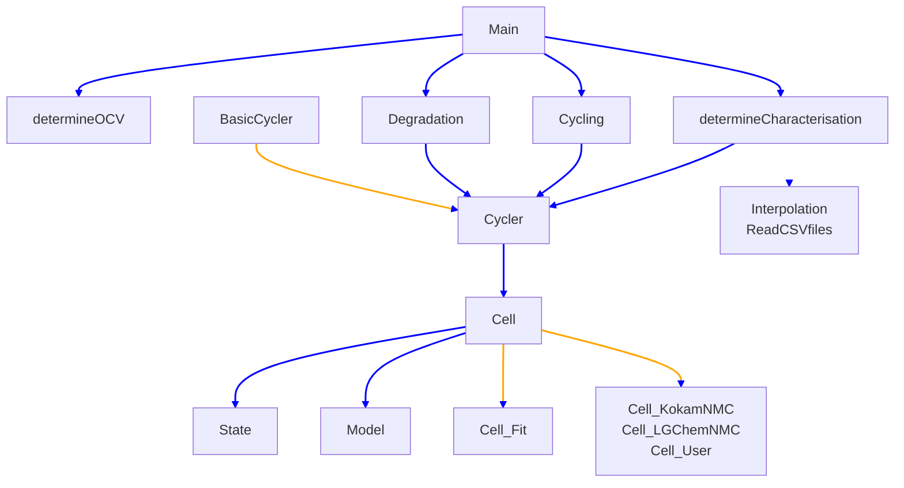
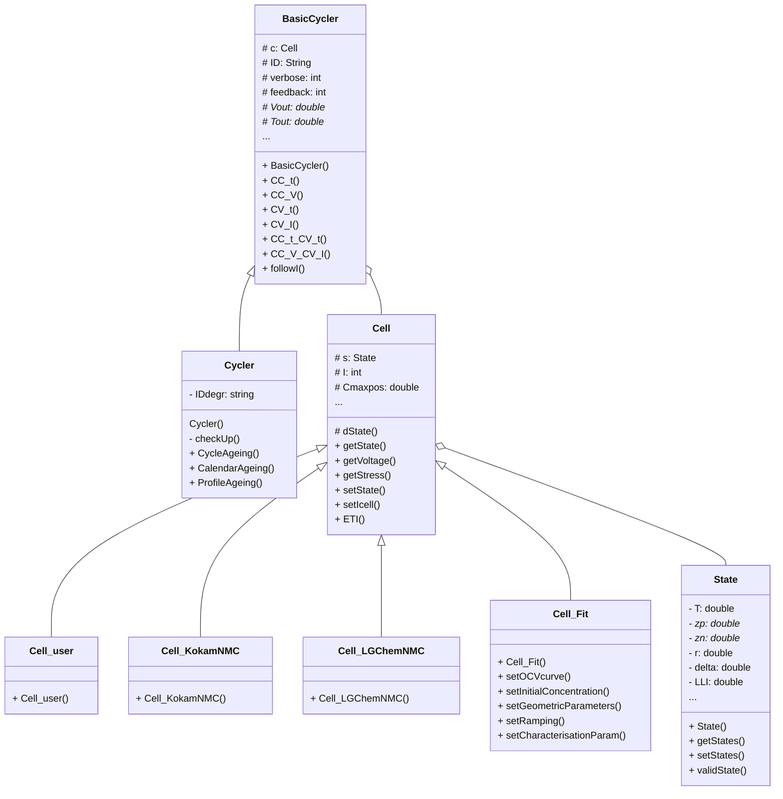

# C++ Code

## Code hierarchy
<p style='text-align: justify;'>
The various cpp files form a structured hierarchy as indicated on the diagram below. Blue lines mean that the functions from the ‘top’ files uses functions from the ‘bottom’ files. Orange lines mean an inheritance, where the arrow points from the (file implementing the) parent to the (file implementing the) child class(es).
</p>

- ```main.cpp``` is the ‘top file’ where users select what to simulate.
- There are 4 ```*.cpp``` files implementing the various things we can simulate: ```determineOCV.cpp```, ```determineCharacterisation.cpp```, ```cycling.cpp```, and ```degradation.cpp```.
- Three of these use a ```Cycler``` (defined in ```cycler.cpp```), which extends the class ```BasicCycler``` (defined in ```BasicCycler.cpp```).
- A (Basic)Cycler uses a Cell from ```cell.cpp```. There are four classes extending Cell, defined in ```cell_fit.cpp``` (used by the functions in determineCharacterisation.cpp for fitting the cell parameters), ```cell_KokamNMC.cpp```, ```cell_LGChemNMC.cpp```, and ```cell_user.cpp``` (which are all three used for the functions in ```cycling.cpp``` and ```degradation.cpp```)
- A Cell uses a State from ```state.cpp``` and a Model from ```model.cpp```.
- The functions for interpolating (```interpolation.cpp```) and reading ```*.csv``` files (```read_CSVfiles.cpp```) are used throughout the code (arrows have not been drawn to avoid confusing the reader).



## Classes

The C++ code is object-oriented. The class diagram is below.

The ```BasicCycler``` class represents a battery tester. It implements functions to load the cell with constant current (CC), constant voltage (CV) or a mix of both. It also stores periodic data about the cell (such as the cell voltage and temperature), which can be written to ```*.csv``` files. A ```basiccycler``` has a Cell-attribute representing the cell which should be loaded (i.e the cell connected to the battery test channel).

The ```Cycler``` class inherits from the ```BasicCycler``` class, and implements the degradation procedures such as cycle ageing, as well as the check-up procedures, such as a capacity measurement.




The `Cell` class is the main class from the model. It implements the battery model in a state-space formulation, where the states are represented by a State-attribute. The function `dstate` calculates the time derivative of all state variables and the function ```ETI``` performs time integration (using a forward Euler integration scheme). It has private functions which implement the various degradation models, grouped per physical degradation mechanism (e.g. there is a function `SEI` which implements all models for simulating the growth of the SEI layer). It has other getters (e.g. to get the cell voltage) and setters (e.g. to set the environmental temperature). Finally, a cell has an attribute `I` representing the current which is running through the cell. There is a setter to change this current, which can be done in small incremental steps (rather than instantaneously changing the cell current).


There are four classes which inherit from Cell: Cell_KokamNMC, Cell_LGChemNMC, Cell_user and Cell_Fit. The first three don’t implement anything extra on top of what they inherit. The only reason why these classes exist is because they have different values of the parameters, to simulate different types of cells. By having this in different classes, it is more transparent to the user which cell is used where in the code. The fourth child-class, Cell_Fit, does implement extra methods because this class is used when cell parameters are fitted (which is done by the code implemented in `determineCharacterision.cpp`). This class therefore lets the user change various parameters of the cell after the object is made. This class (Cell_Fit) should only be used for parameter fitting (by ‘determineCharacterision.cpp’) and not for degradation simulations.
The State-class groups the state-variables of a cell, such as the li-concentration at the spatial discretisation nodes, the cell temperature, the specific resistance, the thickness of the SEI layer, etc. It has getters and setters for most states, as well as a getter and setter which uses an array representation for the states (which is convenient if you want to change all states at once). State also has a function to check if a state-object has valid values. This function will detect if the temperature becomes too high or too low, or if a cell has been degraded too much. It is however not checking if the lithium-concentrations are valid (which is done by functions in `Cell`).

## Other C++ files

Apart from the classes, there are various other functions implemented in various other `*.cpp` files (most of which have corresponding header files).

**main.cpp:** This file implements the `main` function of the project. In this main function, the user has to choose which degradation models to use in the battery model, which cell type to use (the Kokam, LG Chem, or user-defined cell) and the prefix which will be the first part of every name of the subfolders in which the `*.csv` files with the results will be written.
Then, the user has to specify what should be simulated. All the function-calls are implemented already, but they are commented out. If the user wants to simulate, he/she has to uncomment the respective line.

**cycling.cpp:** This file groups the functions used to simulate how a cell is cycled. It has 2 functions: `CCCV` and `followCurrent`. The function `CCCV` simulates a few CCCV cycles for a cell and stores the current, voltage and temperature values. This function can be used to check if the parameters of the cell correspond with measured voltage curves. In the function `FollowCurrent`, a cell has to follow a user-defined current profile. The user specifies in a `*.csv` file for how long each current should be maintained, and the cell tries to follow this current profile. Again, the currents, voltages and temperatures are stored every few seconds. This function can be used to simulate e.g. a drive cycle on the cell.

**degradation.cpp:** This file groups the degradation procedures. It has 3 main functions: `CalendarAgeing` (where the various calendar ageing simulations are defined), `CycleAgeing` (where the various cycle ageing simulations are defined), and `ProfileAgeing` (where the various drive cycle simulations are defined). The functions use multi-threaded code to speed up the calculation even further (by simulating three different degradation experiments at the same time).
This is the file which the user should change to simulate different degradation procedures, e.g. to change the temperature at which calendar ageing is done, or to change the cycle ageing to have only a CC charge instead of a CCCV charge.

**determineOCV.cpp:** This file can be used to fit the model parameters related to the cell’s OCV curve. The user has to supply the measured OCV curve of the cell, and the OCV curves of the separate electrodes. The code then fits the geometric parameters (size of the electrodes) and initial li-concentrations of each electrode. The function `estimateOCVparameters` will call the underlying functions to find the parameters. The search algorithm used is a hierarchical brute-force algorithm. 

**determineCharacterisation.cpp:** This file can be used to fit the model parameters related to the characterisation of the cell. The user has to supply data for a few CCCV charges and/or discharges, and the function `fitCharacterisationAtReferenceT` uses a hierarchical brute-force search algorithm to find the values of the DC resistance, cathode diffusion constant, anode diffusion constant, cathode rate constant and anode rate constants. The search takes a few hours.

**model.cpp:** This file implements the Structure which stores the matrices used for the spatial discretisation of the solid diffusion PDE. It reads the values from the CSV files and stores them in the matrices which together from the struct.

**interpolation.cpp:** This file implements two functions for linear interpolation. They only differ in the way the data-arguments are passed.

**read_CSVfiles:** This file implements some functions to read `*.csv` files to arrays. They throw errors if the `*.csv` files could not be opened.