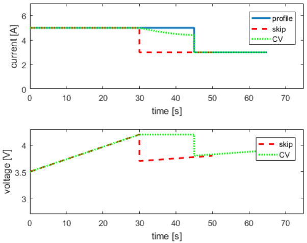

# Cycling

<p style='text-align: justify;'>
This chapter explains how to use the code implemented for cycling a cell. It explains how to simulate a cell which follows a few simple currents, and how the current, voltage and temperature of the cell is periodically stored.
</p>

## What is implemented?

Currently, there is code implemented for a cell to do a few CC CV cycles, and for a cell to follow a predefined current profile. In both cases, the current, voltage and temperature of the cell is stored every few seconds in csv files, which can be displayed using MATLAB code.

The important code is in ```cycling.cpp```. There two functions are implemented:
- **CCCV:** this function shows how to charge a cell, and subsequently do a few CCCV cycles (CC discharge at a given C rate, CV discharge at a given voltage until the current is below a given threshold, CC charge at given C rate, CV charge at a given voltage until the current is below a given threshold). The cycles implemented use currents of 0.5C, 1C and 2C, cycle the cell between its minimum (2.7V) and maximum (4.2V) voltage, have a current threshold of 0.05C for the CV phase on charge, and there is no CV phase on discharge. The code for the underlying functions is defined in BasicCycler.cpp (the functions CC_V_CV_I, CC_V and CV_I to load a cell with a constant current until a given voltage is reached, and with a given voltage until the current is below the defined threshold), and in cell.cpp (the function ETI to do time integration, and dState to calculate the time derivatives). The results are stored in a csv file in the subfolder called ```0_2-0_0-0_2-3_1_CCCV```. 
- **FollowCurrent:** this function shows how to simulate a cell which has to follow a given current profile (such as a drive cycle). The profile must be defined in a csv file with two columns (the first being the current in Amperes, negative for charging and positive for discharging, the second being the time this current has to be maintained for). The user has to specify the length of the profile (number of rows in the profile), and a few settings (such as what to do if a voltage limit is hit while following the profile). The code for underlying functions is defined in cycler.cpp (the function followI to follow a current profile), BasicCycler.cpp (the functions CC_t_CV_t, CC_t to cycle a cell with a constant current for a given time, and CV_t to load a cell with a CV for a given time), and cell.cpp (the function ETI to do time integration, and dState to calculate the time derivatives). As before, the cell voltage and temperature are stored every few seconds in a csv file. The results are stored in a csv file called ```0_2-0_0-0_2-3_1_followCurrent```.


## How do you run it? 

In the main-function defined in ```main.cpp```, you need to indicate

- which cell to use, in the variable ```cellType```,
- how verbose the simulation should be, in the variable ```verbose```. It is recommended to leave it at 1, see [Appendices: Debugging & Common errors](../5_appendices/2_debugging.html),
- and the prefix to append before the name of the subfolders in which the results will be written. It is recommended you use a different prefix for every simulation such that the results are not overwritten.


You then need to uncomment (remove the two backslashes in front of the lines) the line you want to execute.
If you want to simulate the CCCV cycles, uncomment the line with ```CCCV(M, pref, deg, cellType);``` and comment (add two backslashes in front of all other lines) all other function calls (all lines in the blocks under *PARAMETRISATION FUNCTION CALLS*, *CYCLING FUNCTION CALLS*, *DEGRADATION FUNCTION CALLS* except this line). Every function which is not commented out (i.e. the line doesn’t start with //) will be executed so if multiple lines aren’t, each of these things will get simulated.
If you want to simulate a current profile, uncomment the line with ```ProfileAgeing(M, pref, deg, cellType);``` and comment (add two backslashes in front of all other lines) all other function calls (all lines in the blocks under *PARAMETRISATION FUNCTION CALLS*, *CYCLING FUNCTION CALLS*, *DEGRADATION FUNCTION CALLS* except this line). Ensure that all other function calls are commented out. 


Finally build the code and run it as indicated in [Getting started](../1_getting_started/)


## How do you interpret the results?

As said in [Quick configuration](../1_getting_started/3_running.html#quick-configuration) section, both functions write their results in ```*.csv``` files in subfolders. 
- the identification string specified in the CCCV or followI functions in cycling.cpp.
In these subfolders, there are ```*.csv``` files with the so-called *cycling data* of the cell, i.e. periodic measurements of current, voltage, temperature, etc. The format of the files is always the same. Every row contains a new data point. Every column contains data about a different variable:
- Column 1: the total time in seconds since the start of data recording.
- Column 2: the total charge throughput in [Ah] since the start of data recording.
- Column 3: the total energy throughput in [Wh] since the start of data recording.
- Column 4: the cell current in [A], positive for discharging, negative for charging.
- Column 5: the cell voltage in [V].
- Column 6: the cathode potential in [V].
- Column 7: the anode potential in [V].
- Column 8: the cell temperature in [K].
- Column 9: the total time spend on charging in seconds since the start of data recording.
- Column 10: the total charged charge in [Ah] since the start of data recording.
- Column 11: the total charged energy in [Wh] since the start of data recording.
- Column 12: the total time spend on discharging in seconds since the start of data recording.
- Column 13: the total discharged charge in [Ah] since the start of data recording.
- Column 14: the total discharged energy in [Wh] since the start of data recording.
- Column 15: the total time spend on resting in seconds since the start of data recording.


There are MATLAB functions to read these csv files. You have to specify in the MATLAB scripts which files to read by giving the three parts of the name: the prefix (the value of ```pref``` and ```DEG_ID``` as you had defined it in the main-function in main.cpp), the degradation model used (the value of ‘deg’ in the main-function) and the ID string for the cycling data, as you had specified in the ```CCCV``` or ```FollowCurrent``` function in ```cycling.cpp```.


If you simulated the CCCV cycles, run the MATLAB script ```ReadCCCV.m```. It produces a plot of the simulated current, voltage and temperature similar to the figure below.


{:width="60%" }


If you had simulated the current profile, run the matlab script ```ReadFollowCurrent.m```. It produces a plot of the simulated current, voltage and temperature as well as the original current from the profile.

{:width="60%" }


## How do you change something?

### Changing the cell or cell parameters

Two real-life cells are implemented in this code, with different OCV curves and different parameters. To switch between different types, change the value of ```cellType``` to the other value. The two real life cells have values of 0 and 1. On top of this, there is a third ```template``` cell type called ```Cell_user``` where users can implement their own values (in the released code, the parameters of this type are the same as the ones from the Kokam high power cell).

Alternatively, the user can change the parameters of the cell which is being used. The parameters of a cell are defined in its cpp-files: ```cell_KokamNMC.cpp```, ```cell_LGChemNMC.cpp```, and ```cell_user.cpp```. There, the user can directly change the values of all cell parameters and things like the initial lithium concentrations.

Finally, the user can change the OCV curves being used. OCV curves must be supplied by csv files with two columns. The first column must give the lithium fraction in a strictly increasing order, the second column must give the corresponding electrode potential (versus Li/Li+). In the ```*.cpp``` files of the cell types, these ```*.csv``` files are read. E.g. for the LGChemNMC cell the line ```loadCSV_2col("LGChem_OCV_C.csv",OCV_neg_n,OCV_neg_x, OCV_neg_y);``` means the file called LGChem_OCV_C.csv gives the anode potential. If the user wants to use a different OCV curve, the csv file should be put in the folder of the project, and the name in the C++ code should be replaced.

### Changing the cycling regimes

The cycling regimes are defined in ```cycling.cpp```, where they can be changed.

**CCCV:** it should be straightforward on how to change the cycling regime by simply changing the value of the parameters (e.g. changing the value of the variable ```Crate``` will use a different current for the CC phase). If the user only wants to do a CC instead of a CCCV cycle, the value of ```Ccut``` should be set to a value higher than Crate (this means the threshold current for the CV phase is larger than the current used for the CC phase, so you immediately stop with the CV phase).

**followCurrent:** this function is more complex because the user can change different things.

1. **Change the current profile:** The current profile must be supplied as a ```*.csv``` file with two columns. The first column must give the value of the current in Amperes with a positive value meaning a discharge and a negative value meaning a charge. The second column must give the time in seconds the current should be maintained for. A number of example files are supplied (all called ```Current profile xxxxx.csv```). The user can make his/her own profile and put this file in the project folder. Then, in cycling.cpp in the function ```FollowCurrent```, the user has to define which ```*.csv``` file contains the profile. This is done by the variable called ```profile```. If the user changes the string to the name of a different profile, then a different file will be used. If you change the profile, you *have to* change the value of the variable length defined on the line below profile. This variable indicates the length of the profile (i.e. the number of rows in the ```*.csv``` file) and it is very important this value is correct. The C++ code will read exactly length rows, so if the value is wrong then a wrong current profile will be read.
2. **Change what to do when a voltage limit is reached while following the profile:** The user can specify what should happen when a cell is following the current profile but hits the voltage limit and it can no longer follow the specified current. There are two options: either the cell skips the rest of this step and immediately tries to follow the current of the next step, or the cell can do a constant voltage (dis)charge at that voltage limit for the rest of the time. Both are illustrated on the graph below (blue is the current profile, red is the current/voltage if you skip the rest of the step, green is the current/voltage if you do a CV for the rest of the period).
Note that the red current lasts only 50 seconds while the full profile was 65 seconds because the first current was only maintained for 30 seconds instead of 45 seconds. The variable limit (in the function ```FollowCurrent```, in the ```*.cpp``` file ```cycling.cpp```) indicates which option should be used in the simulation. A value of 0 indicates the cell will skip the rest of the step, while a value of 1 indicates the cell will do a CV for the rest of the step.

{:width="60%" }

3. ```Change the voltage limit:``` The voltage window in which the cell should operate can be defined by the user by changing the values of ```Vmax```, the upper voltage limit, and ```Vmin```, the lower voltage limit (in the function ```FollowCurrent```, in the ```*.cpp``` file ```cycling.cpp```). These values should always be realistic cell voltages (e.g. if you set Vmin to 0, the code will crash at some point because this is not a feasible cell voltage).


### Change the data collection

When you make a ```Cycler``` object, you have to specify how often you want to store the data. In both cycling functions, this is done by the variable ```timeCycleData```. That variable indicates the time interval (in seconds) at which you want to store data. Only integer values are allowed, and if it is set to 0, no data is stored. There is one exception: when you are following a current profile and you are storing data (i.e. ```timeCycleData``` is not 0), you will always store at least one data point per step in the profile. So if you set ```timeCycleData``` to 2, but a given current should only be maintained for 1 second, you will still store that data point).

The maximum length of data files is 100,000 lines (which is the size of the memory buffer in the ```BasicCycler```). This means that if you have more than 100,000 data points (e.g. because the current profile is very long), the resulting data will be spread out over multiple ```*.csv``` files. The MATLAB script reads all files and ‘stacks’ the data after each other (i.e. the data from the 2nd file is appended behind the data from the first file).