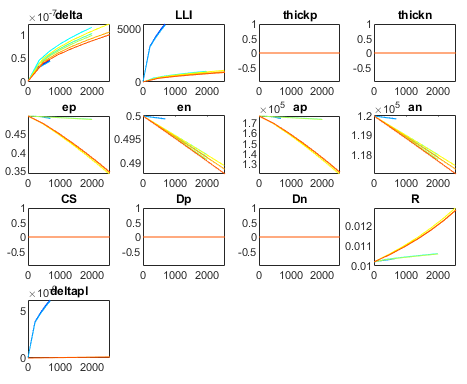
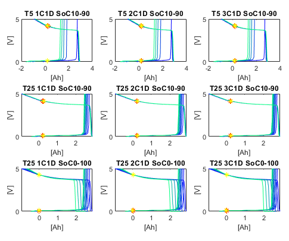

# Degradation

This chapter explains how to use the code implemented for simulating degradation experiments on a cell, and how the data is stored and interpreted.

## What is implemented?

The settings of the degradation simulations are defined in `degradation.cpp`. Settings include things like the environmental temperature, currents to be used for charging or discharging, voltage window of the cycles, etc. Each degradation simulation (e.g. cycling a cell 1000 times with given parameters) is done on a separate thread, such that multiple simulations can be done in parallel using multi-threaded calculations.

The degradation procedures are defined in `cycler.cpp`. There is one procedure for calendar ageing (where a cell is left at a given voltage and temperature), one for cycle ageing (where a cell is continuously cycled with a CC or CCCV (dis)charge with given parameters), and one for profile ageing (where a cell continuously follows a current profile such as a drive cycle). This class also implements functions for the check-up procedure, e.g. to record the cell’s capacity, half-cell OCV curves, a pulse discharge test, or some constant current cycles.

The results from each simulation is written in a separate subfolder. In this subfolder, csv files are written with the results from the check-up procedures (e.g. the cell’s capacity, half-cell OCV curves, etc.) and cycling data (the cell’s current, voltage and temperature every few seconds). These files can be read by MATLAB functions which will plot the outcomes.

In `degradation.cpp`, the following functions are implemented:

- `CycleAgeing`: This function defines degradation settings for 21 cycle ageing simulations. There are general settings such as: how many cycles to simulate, how many cycles between check-ups, how often to store cycling data (periodic current, voltage and temperature measurements), and the parameters of the check-up procedures (e.g. whether or not to record the half-cell OCV curves, the pulse profile to be used for the pulse discharge, etc.). Then there are the settings which define the cycles with which a cell should be cycled such as: whether to include a CV phase on (dis)charge or not, the currents to be used, the voltage window in which the cell should be cycled, and the environmental temperature. In total 21 simulations have been programmed, each with slightly different load cycles (different currents, voltage windows and temperatures).
- `CalendarAgeing`: This function defines degradation settings for 9 calendar ageing simulations. There are general settings such as: how long to rest the cells in total, how long to rest a cell between check-ups, how often to store cycling data (periodic current, voltage and temperature measurements), and the parameters of the check-up procedures (e.g. whether or not to record the half-cell OCV curves, the pulse profile to be used for the pulse discharge,
etc.). Then there are the settings which define the conditions at which a cell should be rested: how often to recharge to the set voltage, the voltage and the environmental temperature at which a cell should be rested. In total 9 simulations have been programmed, each with slightly different resting conditions (different rest voltages and temperatures).
- `ProfileAgeing`: This function defines degradation settings for 12 profile ageing simulations. There are general settings such as: how often to repeat the profile in total, how often the profile should be repeated between check-ups, how often to store cycling data (periodic current, voltage and temperature measurements), and the parameters of the check-up procedures (e.g. whether or not to record the half-cell OCV curves, the pulse profile to be used for the pulse discharge, etc.). Then there are the settings which define the profiles with which a cell should be cycled such as: the profile to be used, the voltage window in which the cell should stay, and the environmental temperature. In total 12 simulations have been programmed, 4 different profiles and each at different voltage windows and temperatures.
- `Calendar_one`: this is a very short functions which takes the settings of the calendar ageing experiment as input, makes a Cell and a Cycler and calls the calendar ageing function of the cycler-object. It also defines the time step used for time integration.
- `Cycle_one`: this is a very short functions which takes the settings of the cycle ageing experiment as input, makes a Cell and a Cycler and calls the cycle ageing function of the cycler-object. It also defines the time step used for time integration.
- `Profile_one`: this is a very short functions which takes the settings of the profile ageing experiment as input, makes a Cell and a Cycler and calls the profile ageing function of the cycler-object.

In cycler.cpp, there are three functions for the degradation procedures as well as a couple of functions implementing the check-up procedure:
- cycleAgeing: this function continuously cycles a cell with the same load cycle. Periodically, a check-up is done. The input parameters define the exact cycle to be used (CC or CCCV, voltage window, currents, environmental temperature) and the settings of the check-up which should be done (what to include in the check-up and details of some check-up procedures such as the pulse profile to be used for the pulse discharge).
- calendarAgeing: this function continuously rests a cell. Periodically, a check-up is done. The input parameters define the conditions at which the cell should be rested (voltage and temperature), how often to recharge to this voltage and the settings of the check-up which should be done (what to include in the check-up and details of some check-up procedures such as the pulse profile to be used for the pulse discharge).
- profileAgeing: this function continuously cycles a cell with the same current profile. Periodically, a check-up is done. The input parameters define the profile to be used, the voltage window in which the cell should stay, what to do if a voltage limit is reached, the environmental temperature and the settings of the check-up which should be done (what to include in the check-up and details of some check-up procedures such as the pulse profile to be used for the pulse discharge). If the current profile is a net discharge, the cell is first fully charged to the upper voltage limit and then the profile is repeated until the lower voltage limit is reached. The cell is then recharged back to the upper voltage limit and the profile is again repeated until the lower voltage is reached. Etc. Oppositely if the profile is a net charge (discharged to the lower voltage, repeated profile to the upper voltage limit, re-discharged to the lower voltage etc.). The profile must be able to be repeated at least twice before hitting a voltage limits (e.g. if the profile is a net discharge, then if the cell starts from the upper voltage limit, the profile must be able to repeated at least twice before the lower voltage limit is reached). This is to ensure that the cell can actually follow the specified profile to a decent extent (and avoid that you spent most time in re-(dis)charging the cell instead of following the profile).
- getCapacity: this function measures a cell’s capacity by fully charging it (CCCV) to its maximum voltage limit and then doing a full discharge (CCCV) to the minimum voltage limit at a reference temperature of 25°. The charge which can be discharged (between said voltage limits in both the CC and CV phases) is defined to be the cell’s capacity. The CC phase is at a C/25 current and the CV phase is until a cut-off current of 0.005C.
- getOCV: this function records the half-cell pseudo-OCV curves. Each electrode is charged and discharged to/from its extreme lithium concentrations (0 to the maximum lithium concentration for that electrode) independently of each other and the potential of the electrode is recorded. The half-cell curves are then aligned on a common x-axis which gives the discharged charge starting from a fully charged cell (i.e. a cell which is at the maximum allowed voltage).
- checkUp_batteryStates: This is the most basic check-up procedure. It measures the cell capacity and the different battery states (e.g. sei thickness, resistance, lost lithium, etc.). Along with the battery states, it also records how long the cell has been degrading for (i.e. time spent, total charge throughput, etc.). This data is appended on a new line in a csv file such that after the degradation simulation is done, the csv file contains the evolution of the battery states over the cell’s lifetime.
- checkUp_OCVcurves: This function appends the half-cell OCV curves in a csv file such that at the end of the simulation there is one csv file with the evolution of the OCV curves over the cell’s lifetime.
- checkUp_CCCV: This function cycles the cell with a few CCCV cycles (CC or CCCV charge, CC or CCCV discharge between the minimum and maximum cell voltage at user-specified currents) and records the cell’s current, voltage and temperature in a csv file. A different file is written for each check-up so to assess how the cycling performance of the cell varies over its lifetime, all csv files have to be read and compared with each other.
- checkUp_pulse: This function first charges the cell and then does a pulse discharge test (repeating a net discharge current profile until the lower voltage limit of the cell is reached). The function records the cell’s current, voltage and temperature in a csv file. A different file is written for each check-up so to assess how the pulse performance of the cell varies over its lifetime, all csv files have to be read and compared with each other.
- checkUp: This is the ‘top level’ check-up function which calls each of the four different check-up procedures if needed. At the end of the check-up, the original battery state is restored such that the cell can resume the degradation experiment. The user can choose whether to account for degradation during the check-up or not. It is highly recommended to ignore degradation while doing a check-up to ensure the recorded data is accurate for the condition of the cell in the degradation experiment. (e.g. when a cell is close to the end of its lifetime, the slow discharge to record the cell’s capacity can lead to excessive degradation and therefore significantly reduce the measured capacity of the cell)

All of these functions use functions from the BasicCycler (to load a cell with a constant current or voltage or to follow a current profile) and from the Cell (for time integration and calculating the time derivatives of the battery states)

## How do you run?

As was the case for cycling, you need to indicate in the main-function defined in ‘main.cpp’
- which cell to use, in the variable ‘cellType’,
- how verbose the simulation should be, in the variable ‘verbose’. It is recommended to leave it at 1, see ‘7 appendices; debugging, basics of C++, object oriented programming.docx’,
- and the prefix to append before the name of the subfolders in which the results will be written. It is recommended you use a different prefix for every simulation such that the results are not overwritten.
Next in main, you have to decide which degradation models to use. The parameters for each model have been defined in the constructors of the two cells, but here you chose which models to turn ‘on’ or ‘off’. The name of the subfolder in which the results from the degradation simulation will be written will start with a representation of which degradation models you used.
Then, you need to uncomment (remove the two backslashes in front of the lines) the line you want to execute.
- If you want to run the calendar ageing simulation, uncomment the line ‘CalendarAgeing(M, pref, deg, cellType)’ and comment all other function calls.
- If you want to run the cycle ageing simulation, uncomment the line ‘CycleAgeing(M, pref, deg, cellType)’ and comment all other function calls.
- If you want to run the calendar ageing simulation, uncomment the line ‘ProfileAgeing(M, pref, deg, cellType)’ and comment all other function calls.
Ensure that all other function calls (all lines in the blocks under ‘PARAMETRISATION FUNCTION CALLS’, ‘CYCLING FUNCTION CALLS’, ‘DEGRADATION FUNCTION CALLS’) are commented. Every function which is not commented (i.e. the line doesn’t start with //) will be executed so if multiple lines aren’t, each of these things will get simulated.
Finally build the code and run it as indicated in the document ‘1 getting started’.

## How do you interpret?

As before, the results from the simulations are written in subfolders. There is one subfolder per experiment. The name of the subfolder consists of three parts (in this order)
- the prefix: in main you have to define a string called prefix. The name of all subfolders will start with the value of this string, followed by an underscore
- the degradation identification: a series of numbers will indicate which degradation models were used during the simulation (the string is generated by the function print_DEG_ID in degradation.cpp or by the MATLAB script printDEGID.m). identifiers of the same mechanism are separated by a hyphen (-), while identifiers of different mechansisms are separated by an underscore (‘_’). E.g. 1-0_2-3-1_1-4_1 means we use
    - 1-0 SEI model 1, no porosity changes due to SEI
    - 2-3-1 CS models 2 and 3, decrease the diffusion constant according to model 1
    - 1-4 LAM models 1 and 4
    - 1 Li lating model 1
- the identification string describing the degradation experiment. These are the strings specified in the three functions (CycleAgeing, CalendarAgeing and profileAgeing) in degradation.cpp.
E.g. ‘0_2-0_0-0_2-3_1_T45_1C1D_SoC0-100’ contains the data of a simulation which had as prefix 0, had degradation model identifier ‘2-0_0-0_2-3_1’ (SEI model 2, no porosity change due to SEI, no surface crack, no diffusion decrease, LAM models 2 and 3, and lithium plating model 1) and was for a cell which was cycling at a 1C charge and 1C discharge at a temperature of 45 degrees between 0% and 100% state of charge.


In the folder, there will be a number of files (where ‘x’ is a number starting at 0):
- CyclingData_x.csv: these files contain the ‘cycling data’ of the cell at a constant time interval (which is specified in the function in degradation.cpp), i.e. the current, voltage, and
temperature of the cell. Every row contains a new data point. Every column contains data about a different variable:
    - Column 1: the total time in seconds since the start of this data batch.
    - Column 2: the total charge throughput in [Ah] since the start of this data batch.
    - Column 3: the total energy throughput in [Wh] since the start of this data batch.
    - Column 4: the cell current in [A], positive for discharging, negative for charging.
    - Column 5: the cell voltage in [V].
    - Column 6: the cathode potential in [V].
    - Column 7: the anode potential in [V].
    - Column 8: the cell temperature in [K].
    - Column 9: the total time spend on charging in seconds since the start of this data batch.
    - Column 10: the total charged charge in [Ah] since the start of this data batch.
    - Column 11: the total charged energy in [Wh] since the start of this data batch.
    - Column 12: the total time spend on discharging in seconds since the start of this data batch.
    - Column 13: the total discharged charge in [Ah] since the start of this data batch.
    - Column 14: the total discharged energy in [Wh] since the start of this data batch.
    - Column 15: the total time spend on resting in seconds since the start of this data batch.
The values of the ‘cumulative variables’ (those relating with the time, charge or energy throughput) are reset to 0 at the start of every data batch, so at the start of every csv file with data they are 0 (and they increase throughout the file). When the user wants to plot all data behind each other, the end-value of one file has to be added up to all values in the next file. This is done in the MATLAB functions provided along the C++ code
- DegradationData_batteryState.csv: This file contains one line per check-up performed on the cell. See the function Cycler::checkUp_batteryState
    - Column 1: number of cycles / profile repetitions done until now
    - Column 2: total time in hours until now
    - Column 3: total charge throughput in Ah until now
    - Column 4: total energy throughput in Wh until now
    - Column 5: the remaining cell capacity in Ah
    - Columns 6-10: the transformed lithium concentration at the discretisation nodes in the cathode
    - Column 11-15: the transformed lithium concentration at the discretisation nodes in the anode
    - Column 16: temperature of the cell in Kelvin
    - Column 17: thickness of the SEI layer in meter
    - Column 18: lost lithium in As
    - Column 19: thickness of the cathode in meter
    - Column 20: thickness of the anode in meter
    - Column 21: volume fraction of active material in the cathode
    - Column 22: volume fraction of active material in the anode
    - Column 23: effective surface area in the cathode in m2 / m3
    - Column 24: effective surface area in the anode in m2 / 3m
    - Column 25: the surface area of cracks at the surface of the negative particle in m2
    - Column 26: the diffusion constant (at reference temperature) of the cathode in m / s
    - Column 27: the diffusion constant (at reference temperature) of the anode in m / s
    - Column 28: the specific DC resistance of the electrodes in Ohm m2
    - Column 29: the thickness of the plated lithium in meter
    - Column 30: The total DC resistance of the cell in Ohm
    - Column 31: the active anode surface area excluding cracks in m2. This is the product of the effective surface area and the electrode volume (which in turn is the product of the electrode thickness and the geometric surface area of the electrode, i.e. the product of the height and length of the electrode).
- DegradationData_OCV.csv: This file contains the half-cell OCV curves, one set of three lines per check-up. The first line gives the common x-axis which indicates the charge [Ah] discharged from the point where the cell was fully charged (i.e. the x-value is 0 when the difference between the cathode OCV and anode OCV is equal to the cell’s maximum voltage). The second line gives the cathode OCV (in Volt) and the third line gives the anode OCV (in Volt). Then there is an empty line, and the next three lines are the OCV curves from the next check-up. On the line of the anode OCV (lines 4, 8, 12, etc), there are two additional numbers in the last columns (the first n columns gives the OCV, then there are 2 empty columns, and then there are 2 numbers). These numbers are the electrode OCV where the cell was operating before the check-up procedure was called (the first being the cathode OCV and the second the anode OCV). E.g. during calendar ageing, these two values indicate the potential of each electrode at which the cell is actually resting. See the function Cycler::checkUp_batteryStates
- DegradationData_CheckupCycle_x.csv: these files contain the cycling data from the cell from the CCCV part of the check-up (where a cell is cycles with a few CCCV cycles). There is one file per check-up (x = 0 for the first check-up) and the columns in the file are the same as for the cycling data of the degradation procedure as written in CyclingData_x.csv.
- DegradationData_CheckupPulse_x.csv: these files contain the cycling data from the cell from the pulse discharge done as part of the check-up (where a cell is discharged with a repeated pulse profile). There is one file per check-up (x = 0 for the first check-up) and the columns in the file are the same as for the cycling data of the degradation procedure as written in CyclingData_x.csv.

There are MATLAB functions to read all these files and display the results. There is one function per simulation you were doing (ReadCycleAgeing.m, ReadProfileAgeing.m and ReadCalendarAgeing.m). Open the MATLAB script corresponding to what you were simulating.
In the section ‘Identifiers’ in the MATLAB script you have to give some information to MATLAB about which files to read. The details you have to specify are:
- Pref: the prefix you were using as defined by pref in the main-function in main.cpp, e.g. 0 (as a string)
- The degradation models you were using as defined by the variable deg in the main-function in main.cpp (if you were using multiple models for one mechanism you have to specify it as an array as is currently the case for LAM_id because we are using two models for LAM
- The descriptions of the degradation experiments you were doing (in the variable ‘IDs’). In the released version, these IDs are correctly specified to be consistent with the C++ code. In the C++ code you could have changed these IDs (in the variable ‘name’ which is given to every simulation in the functions in degradation.cpp), in which case you also have to change them in MATLAB).
You can also choose the x-axis of the plot for the remaining capacity using the variable ‘FECx’. If it is true, the x-axis gives ‘full equivalent cycles’, else it gives time.
The output from the 4 different check-up procedures is plotted (if you included them in the simulation) as well as the cycling data from the cell (if it was stored).
E.g. you can look at what causes the loss of capacity in the plot from the degradation states, where the evolution of each state is shown for each experiment. Each subplot is one stage, and the different lines are the different simulated experiment.

{:width="60%" }

You can also look at how the half-cell OCV curves slip as the cells age. There is one subplot per simulated experiment, and the different lines are the OCV curves measured at different points in the cells’ life time.

{:width="60%" }

Or you can analyse the voltage response to a pulse discharge test. Again, every subplot is for one simulated experiment and the various lines are the responses at different states in the cells’ lifetime.

{:width="60%" }

And you can look in detail at the cycling data of the cell. E.g. in the plot below, you can see the voltage, current and temperature of a cell which was cycling at 5 degrees between 10% and 90% SoC. The 5 different regions are the 5 check-ups done during the degradation simulation (e.g. you can clearly see the check-ups were done at 25 degrees instead of 5, and that they covered a larger voltage range).

{:width="60%" }


## How do you change? 

### Changing the cell or parameters

Two real-life cells are implemented in this code, with different OCV curves and different parameters. To switch between different types, change the value of ‘cellType’ to the other value. The two real life cells have values of 0 and 1. On top of this, there is a third ‘template’ cell type called ‘Cell_user’ where users can implement their own values (in the released code, the parameters of this type are the same as the ones from the Kokam high power cell).

Alternatively, the user can change the parameters of the cell which is being used. The parameters of a cell are defined in its cpp-files: cell_KokamNMC.cpp, cell_ LGChemNMC.cpp, and cell_user.cpp. There, the user can directly change the values of all cell parameters and things like the initial lithium concentrations. This includes the parameters of the degradation models.

Finally, the user can change the OCV curves being used. OCV curves must be supplied by cvs-files with two columns. The first column must give the lithium fraction in a strictly increasing order, the second column must give the corresponding electrode potential (versus li/li+). In the cpp-files of the cell, the csv files are read. E.g. for the LGChemNMC cell the line loadCSV_2col("LGChem_OCV_C.csv",OCV_neg_n,OCV_neg_x, OCV_neg_y); means the file called LGChem_OCV_C.csv gives the anode potential. If the user wants to use a different OCV curve, the csv file should be put in the folder of the project, and the name in the c++ code should be replaced.

### Changing which degradation models are included for the simulation

There are many degradation models implemented in the code. The user can choose which ones should be included for every simulation. This must be done in the main function in main.cpp. There is a structure from the type DEG_ID which defined the degradation models included.
The degradation models are grouped per physical mechanism they simulate (SEI growth, surface crack growth, loss of active material or lithium plating). You can use maximum 10 different models per degradation mechanism (the maximum length of the arrays is 10)
- For the SEI growth, you first have to define how many different SEI-models you want to use (in the parameter SEI_n). Then you have to say which models to use in an array (SEI_id). E.g. if you use only one model, this has to be put in field 0 (```SEI_id[0]```) and if you want to also use a second model this has to be in field 1 (```SEI_id[1]```)., etc. Finally, the user has to say whether the porosity of the electrode should be decreased due to the growing SEI layer or not (SEI_porosity, 1 if it should and 0 if it shouldn’t). The comments in main explain which number corresponds to which model.
- For the surface crack growth, you first have to define how many different crack growth-models you want to use (in the parameter CS_n). Then you have to say which models to use in an array (CS_id). E.g. if you use only one model, this has to be put in field 0 (```CS_id[0]```) and if you want to also use a second model this has to be in field 1 (```CS_id[1]```)., etc. Finally, the user has to say whether the diffusion constant of the electrode should be decreased due to the increasing cracks or not (CS_diffusion, 1 if it should and 0 if it shouldn’t). The comments in main explain which number corresponds to which model.
- For the loss of active material, you first have to define how many different LAM-models you want to use (in the parameter LAM_n). Then you have to say which models to use in an array (LAM_id). E.g. if you use only one model, this has to be put in field 0 (```LAM_id[0]```) and if you want to also use a second model this has to be in field 1 (```LAM _id[1]```)., etc. The comments in main explain which number corresponds to which model
- For lithium plating, you only have to say which model to use (only one model is implemented) in the variable pl_id.

### Change the data collection

When you make a Cycler-object, you have to specify how often you want to store the cycling data (periodic values of the cell current, voltage and temperature). In all degradation-functions, this is done by the variable timeCycleData. That variable indicates the time interval (in seconds) at which you want to store data. Only integer values are allowed, and if it is set to 0, no data is stored. There is one exception: when you are following a current profile and you are storing data (i.e. timeCycleData is not
0), you will always store at least one data point per step in the profile. So if you set timeCycleData to 2, but a given current should only be maintained for 1 second, you will still store that data point).
It is not recommended to store cycling data from the profile degradation experiments. The reason is that huge amounts of data will be generated due to the large number of data points (e.g. if each step in the profile is 1s, you generate 31.5 million data points for per year of degradation). Apart from flooding your hard drive, it will also take very long (many hours) to write all this data to hard disk.

The maximum length of data files is 100,000 lines (which is the size of the memory buffer in the Cycler). When you want to store more points, a csv file with the first 100,000 values is written and the buffer is cleared such that you can store the next 100,000 values. This means that the cycling data will be spread out over multiple csv files. The MATLAB function reads these different files and append the data to one graph.

For the data collection of the cycling data during the check-up, see the section ‘Change the settings of the check-up procedure’.

### Change the settings of the degradation simulations without changing the procedure itself

The ‘settings’ are things like the exact voltage as which a cell has to rest, or the current which should be used for the CC phase of a cycle ageing experiment. The settings are changed in degradation.cpp.
- CalendarAgeing: this function defines the settings for the calendar ageing experiments. At the top of this functions, the general settings are defined. The comments explain what the settings are and users can change the values. E.g. if you want to recharge the cells every day to the specified voltage, you have to change the value of mode to 1 instead of 0. If you want to use different settings for the different experiments which are simulated, then simply give the parameter a different value for each experiment (as is done for the variables V and Ti). Then for every experiment you can choose the voltage and temperature at which a cell should rest, as well as the name by which you can identify the results from this experiment. Remember that if you change the names of the simulations in the C++ code, you will also have to change them in the MATLAB function which reads the files. If you want to simulate fewer experiments, you can remove or comment out the others. But do make sure that you join every thread you start. I.e. if you write somewhere ‘std::thread xxxx’ then somewhere else, there must be the command ‘xxxx.join()’. You can’t join threads which weren’t started, and neither can you leave threads running without joining them (then the code will never finish). If you remove the line which starts a thread, also ensure to remove the line which joins the thread and vice versa. If you want to simulate more experiments, you can copy-paste from the existing experiment definitions and simply change the values of the voltage, temperature and name. The thread will have to have a different name from the already existing threads (e.g. call it cal10) and ensure that you add a join-command before the end of the function (e.g. ‘cal10.join()’). It is recommended to start maximum 3 threads before you join them, as is done in the already implemented code. If you have a quad-core CPU you can start up to 7 threads together (starting 8 will flood the CPU so your computer will be very slow if you try to do something else while the simulation is running).
- CycleAgeing: this function defines the settings for the cycle ageing experiments. At the top of this functions, the general settings are defined. The comments explain what the settings are and users can change the values. E.g. if you want to have only a CC charge then set CVcha to false. If you want to use different settings for the different experiments which are simulated, then simply give the parameter a different value for each experiment (as is done for the variables Vma, Vmi, Ti, Ccha and Cdis). Then for every experiment you can choose the voltage window in which the cell should cycle, the environmental temperature and the currents to use during the CC phases on charge and discharge, as well as the name by which you can
identify the results from this experiment. Remember that if you change the names of the simulations in the C++ code, you will also have to change them in the MATLAB function which reads the files. If you want to simulate fewer experiments, you can remove or comment out the others. But do make sure that you join every thread you start. I.e. if you write somewhere ‘std::thread xxxx’ then somewhere else, there must be the command ‘xxxx.join()’. You can’t join threads which weren’t started, and neither can you leave threads running without joining them (then the code will never finish). If you remove the line which starts a thread, also ensure to remove the line which joins the thread and vice versa. If you want to simulate more experiments, you can copy-paste from the existing experiment definitions and simply change the values of the voltage, temperature and name. The thread will have to have a different name from the already existing threads (e.g. call it cyc22) and ensure that you add a join-command before the end of the function (e.g. ‘cyc22.join()’). It is recommended to start maximum 3 threads before you join them, as is done in the already implemented code. If you have a quad-core CPU you can start up to 7 threads together (starting 8 will flood the CPU so your computer will be very slow if you try to do something else while the simulation is running).
- ProfileAgeing: this function defines the settings for the profile ageing experiments. At the top of this functions, the general settings are defined. The comments explain what the settings are and users can change the values. E.g. if you want to have a CV phase when you hit a voltage limit while following the profile limit instead of skipping to the next step in the profile, you have to change limit to 1. If you want to use different settings for the different experiments which are simulated, then simply give the parameter a different value for each experiment (as is done for the variables Vma, Vmi, Tenv). Then for every experiment you can choose the voltage window in which the cell should cycle, the environmental temperature and which profile to follow. Note that you also have to specify how many steps there are in each profile in the variable length. You can also change the name by which you can identify the results from this experiment. Remember that if you change the names of the simulations in the C++ code, you will also have to change them in the MATLAB function which reads the files. In the distributed code, 4 current profile are provided: Current Profile drive cycle HWFET.csv, Current Profile drive cycle NYCC.csv, Current Profile drive cycle UDDS.csv, Current Profile drive cycle US06.csv, and Current Profile random.csv. If you want to use one of those, you can simply change the value of profile to the name of the csv file which has the profile you want to use. You also have to change the value of length to the length of the new profile you want to use. You can also make your own current profile. A profile must be defined in a csv file with two columns. The first column gives the current (in Amperes) for each step of the profile, where a positive value indicates a discharge and a negative value indicates a discharge. The second column gives the time (in seconds) that each step should take. The csv file with your profile must be put in the folder of this project. You then have to change the value of profile to the name of the csv file with your profile. You also have to change the value of length to give the number of steps of your profile (i.e. the number of rows in the csv file). If you want to simulate fewer experiments, you can remove or comment out the others. But do make sure that you join every thread you start. I.e. if you write somewhere ‘std::thread xxxx’ then somewhere else, there must be the command ‘xxxx.join()’. You can’t join threads which weren’t started, and neither can you leave threads running without joining them (then the code will never finish). If you remove the line which starts a thread, also ensure to remove the line which joins the thread and vice versa. If you want to simulate more experiments, you can copy-paste from the existing experiment definitions and simply change the values of the voltage, temperature and name. The thread will have to have a different name from the already existing threads (e.g. call it p13) and
ensure that you add a join-command before the end of the function (e.g. ‘p13.join()’). It is recommended to start maximum 3 threads before you join them, as is done in the already implemented code. If you have a quad-core CPU you can start up to 7 threads together (starting 8 will flood the CPU so your computer will be very slow if you try to do something else while the simulation is running).


### Change the settings of the check-up procedure

Users can change the settings of the check-up procedure in the functions CalendarAgeing, CycleAgeing and ProfileAgeing. The settings are in the code blocked titled ‘2 check-up procedure’. There, users can change the settings of the 4 aspects of a check-up procedure in a structure called proc:
- Capacity measurement: users can choose not to measure the capacity by setting capCheck to false.
- Half-cell OCV measurement: users can choose not to measure the half-cell OCV curves by setting OCVCheck to false.
- CCCV cycles: In this part of the check-up, a cell is cycled with a few CCCV (dis)charges at various Crates. The current, voltage and temperature is recorded. This feature can be turned off by setting CCCVCheck to false. The user can choose how many cycles to do in the variable ncycles. There is a maximum of 100 cycles and one cycle consists of a discharge and a charge. For every cycle, the user has to say which Crate to use in the array Crates, which has one field per cycle (so the Crate of the first cycle is in Crates[0], the Crate of the second cycle is in Crates[1], etc.). Finally, the user has to specify the values of the (Crate of the) current thresholds of the CV phases. The thresholds must be the same for all cycles. There is one threshold for charging, Ccut_cha, and one for discharging Ccut_dis. If the current threshold of the CV phase is larger than the current during the CC phase, no CV is done at all (e.g. if you do a 1C CC charge with a threshold of 2C then there is no CV phase because the cut-off criterium is reached immediately). Note that if you change the cycles, you should also change the matlab script which reads the cycles. The variable ‘Crates’ in readAgeing_CCCV.m must have the C rates of the currents used in the CC phases of the cycles. If they are different, the graphs plotted with the results of this part of the check-up might be wrong.
- Pulse discharge: In this part of the check-up, a cell is discharged with a pulse current profile. This feature can be turned off by setting pulseCheck to false. The user can change the pulse profile to use by changing the name of the csv file in the variable profileName and the length of the profile in the variable profileLength. A profile must be defined in a csv file with two columns. The first column gives the current (in Amperes) for each step of the profile, where a positive value indicates a discharge and a negative value indicates a discharge. The second column gives the time (in seconds) that each step should take. The csv file with your profile must be put in the folder of this project. You then have to change the value of profileName to the name of the csv file with your profile. You also have to change the value of profileLength to give the number of steps of your profile (i.e. the number of rows in the csv file). It is important that the profile is a net discharge, i.e. the integral of the current over the entire profile must be positive (positive is discharge), else the code will throw an error message. The reason why it must be a discharge is because the way the test is coded is by first charging the cell to the maximum voltage and then repeating the supplied profile until the lower voltage is reached. If the profile is a net charge, this obviously wouldn’t work and the user would have to change the code in Cycler::checkUp_pulse.
In the struct defining the check-up procedure, the variable includeCyclingData determines whether the cycling data from the check-up is also stored in the ‘regular cycling data’. While the cell is undergoing the degradation procedure, cycling data (periodic values of the cell current, voltage and temperature) of the cell might be stored. If includeCyclingData is false, this cycling data will only show
what the cell does while it is degrading (e.g. continuously resting or cycling). If includeCyclingData is true, the cycling data will also show what the cell is doing during the check-up procedure (e.g. there will be a period of resting, then a full charge/discharge from the capacity measurement, then another period of resting, etc. ; or a period of continuous cycling, then the cycling data of a check-up, then another period of continuous cycling, etc.).

Finally, the user can choose whether the simulation should account for degradation while doing the check-up by changing the variable blockDegradation (if it is true then degradation is ignored while doing the check-up, if it is false then degradation is included). It is highly recommended to ignore degradation (i.e. set it to true) because otherwise the things you record are not what is actually going on in the cell. Especially when a cell is near the end of its life, significant degradation can occur during the check-up procedures which can lead to very weird situations (e.g. the measured capacity is 1.5Ah but the half-cell OCV curves indicate that the cell reaches the minimum voltage after 1.2Ah because the cell lost another 0.3Ah while recording the half-cell curves).

### Change the degradation procedures [advanced users only]

It is recommended you only do this if you know how to program in C++ and you understand how the code works in general (e.g. how a Cell-object is linked to a Cycler). Changing the procedure means you will have to write new code yourself (and not just change the values of some parameters).
The degradation procedures are defined in cycler.cpp. The calendar ageing procedure is defined in the function CalendarAgeing, the cycle ageing procedure in CycleAgeing and the profile ageing in ProfileAgeing. They all follow a similar setup:

- Function definition: The name and input/output parameters of the functions are defined. If the user wants to add another input (or output) variable, then the function definition must be updated. Function definitions are also defined in the header file Cycler.hpp. A function definition involves the name and the input/output variables of the function. If the user wants to add another input (or output) variable, then the function definition in the header file must be changed as well. If this is not done, the code can’t be built, and you will get an error message “member declaration not found”.
- First a check is done to verify that the input parameters are valid (within the allowed ranges, e.g. the environmental temperature must be between 273K and 333K, which is 0 and 60 degrees). If a parameter is not valid, an error message is printed and error 1014 is thrown which will stop the simulation. If users want to change the allowed range of a variable, or the meaning of a variable, don’t forget to change the validity checks as well. If you add new variables, it is recommended that you add your own checks to avoid errors later in the code.
- In code block ‘1 variables & settings’, some general variables are defined. They are not very important, so it is unlikely you have to make changes here.
- In code block ‘2 cell initialisation’, the environmental temperature is set to the specified value, the cell is brought to the specified voltage, and an initial check-up is done. Users might change the voltage to which a cell is (dis)charged in the cycle- and profile degradation. At the moment, the cell is charged to the maximum voltage so the degradation procedures can start with a discharge. This can be flipped around if desired.
- Code block 3 is where the actual degradation procedure is defined. This is of course specific per function.
    - CalendarAgeing: There is a loop which will rest the cell for a given period (e.g. a month) and then do a check-up (and repeat this x times until the total resting period is reached). There are three options for the type of resting, as defined by the variable mode. If a user wants to change what this function does, it is recommended you do this by adding an extra value for mode. This can be implemented by adding a code
block else if (mode == 3) {CODE HERE}. To define the ageing procedure the user can use the functions from the BasicCycler, which implement things like CC or CV phases, as well as hybrids and profiles. Don’t forget to update the values of the cumulative variables which keep track of where the cell is in the procedure, e.g. update timetot after every function call such that it always contains the total amount of time the cell has been ageing. Don’t forget to update the validity check at the top of the function to accommodate this extra value for mode (else you will get error 1014 when you try to use this new value). Then a check-up is done and the capacity is measured. The simulation is terminated if the remaining capacity is 50% to avoid errors in the code when the cell has degraded too much (e.g. if the resistance increases so much that the cell heats too much and the maximum temperature is reached; or if the capacity is so low that the voltage limits are reached instantaneously). Users can change this value of 50% which is arbitrary (the code still works if this is changed to 30% remaining and probably also for lower values).
    - CycleAgeing: There is a loop which will cycle the cell n times (where n is the user-specified number of cycles to simulate). In the loop, three things are done: discharging the cell; charging the cell; doing a check-up if needed. The discharge and charge can be CC only or CCCV depending on the value of CVdis and CVcha. After a (dis)charge, the cumulative variables giving the total time the cell was ageing and the total charge and energy throughput have to be updated such that they always reflect how much a cell has been cycled. This is where a user might want to change things, e.g. to add a resting period after or during every cycle. As before, you can use the functions from the BasicCycler, which implement things like CC or CV phases, as well as hybrids and profiles. Don’t forget to update the values of the cumulative variables which keep track of where the cell is in the procedure, e.g. update timetot after every function call such that it always contains the total amount of time the cell has been ageing. Finally we do a check-up if needed: the user specified after how many cycles a check-up should be done in nrCap, so if the cycle number is a multiple of nrCap we do a check-up. The simulation is terminated if the remaining capacity is 50% to avoid errors in the code when the cell has degraded too much (e.g. if the resistance increases so much that the cell heats too much and the maximum temperature is reached; or if the capacity is so low that the voltage limits are reached instantaneously). Users can change this value of 50% which is arbitrary (the code still works if this is changed to 30% remaining and probably also for lower values).
    - ProfileAgeing: This is a more complex function. There is a loop which will keep repeating until you have reached the specified number of profile iterations. Inside the loop, three things are done:
        - The profile is repeated using a second nested loop until the cell hits a voltage limit. First the profile is applied (using followI which is defined in BasicCycler), the cumulative variables such as the total degradation time and number of profile iterations are updated and then we check if a voltage limit was reached using the output variable sign from followI. We also have to check if we need to do a check-up, which we had to do every nrCap profile iterations. Because we repeat the profile in this nested loop, we have to check if our total number of repetitions becomes a multiple of nrCap. If it does, we keep repeating the profile until the cell hits a voltage limit but the variable check is set to true to indicate we have to do a check-up. Finally, the code checks that the profile could be repeated more than once before the voltage limit is reached to ensure that you can properly follow the profile while degrading the cell.
        - Then we know the cell is at a voltage limit, so we need to re-(dis)charge the cell. If the profile is a discharge, the cell will have just reached the lower voltage limit so we need to charge the cell to the upper voltage such that we can continue applying the profile. If the profile is a charge, the cell will have just reached the upper voltage limit, so we need to discharge the cell to the lower voltage limit such that we can continue applying the current profile. The cumulative variables are updated to add the time, charge and energy during this (dis)charge to the total degradation time/charge/energy.
        - Finally, a check-up is done if we have repeated the profile nrCap times since the last check-up. This was checked in the first part of the loop (the nested loop), where the variable check was set to true if we need to do a check-up.
- Some functions have a code block 4 where a final check-up of the cell is done (but e.g. in calendar ageing we know that that we did a check-up at the end of the actual degradation procedure so there is no need for this additional code block 4).

### Change the check-up procedures [advanced users only]

It is recommended you only do this if you know how to program in C++ and you understand how the code works in general (e.g. how a Cell-object is linked to a Cycler). Changing the procedure means you will have to write new code yourself (and not just change the values of some parameters).
The check-up procedure has 7 functions in total
- checkUp: this is the main function which is called whenever the degradation experiments want to do a check-up. It sets the temperature to the reference temperature (25°), brings the cell to a voltage below the maximum voltage, calls the 4 functions each doing one aspect of the check-up. If you make an additional function for the check-up (e.g. to do a voltage relaxation test), you will have to call that function here (in code block ‘2 do the different check-up tests). It is recommended to wrap your new function call in a try-catch block as is done with the 4 existing function calls such that errors in your new code don’t propagate through the rest of the code. Finally the original battery state (temperature, voltage, etc.) is restored.
- checkUp_batteryStates: this is a very short function which simply writes some things in a csv file. It isn’t envisaged you should make changes here.
- checkUp_OCVcurves: this is a short function which only writes the OCV curves to a csv file. If you want to change how the OCV curves are reported, you should change that here (e.g. if you want to remove the ‘operating point’ from the curves)
- checkUp_CCCV: The cell is first fully charged. Then the stored cycling data of the cell is flushed (written to a csv file) such that we can record the cycling data of the CCCV cycles on its own. Then the cell is loaded with the specified CCCV cycles. Here the user might want to make some changes. E.g. for now it is hard-coded that the cycles go from the minimum to the maximum cell voltage. The voltage limit can be changed by hard-coding another value, or by adding an extra input parameter to the function. If an extra input parameter is added, this has to be changed in the function definition in both cycler.cpp and Cycler.hpp. Then this additional parameter has to be supplied when checkUp_CCCV is called by checkUp. In order to get the additional parameter in checkUp, it is recommended that you add an extra field in the struct checkUpProcedure, which is defined in Cycler.hpp. There, you can add a field (e.g. ‘double Vmax’) and then when you make the settings of the check-up (which is done in the functions in degradation.cpp), the value of this field can be set (e.g. ‘proc.Vmax = 3’). Then in checkUp you can access this field and pass it on to checkUp_CCCV (e.g. checkUp_CCCV (proc.blockDegradation, proc.nCycles, proc.Crates, proc.Ccut_cha, proc.Ccut_dis, proc.Vmax);’) Finally, the cycling data from the CCCV cycles is written to a separate file.
- checkUp_pulse: This function is similar to checkUp_CCCV. First the csv file with the pulse profile is read, it is verified that the profile is a net discharge, the cell is charged to the maximum voltage and the stored cycling data is flushed. In code block ‘3 do the pulse discharge …’, the current profile is applied repeatedly inside a loop until the lower voltage limit of the cell is reached. Finally, the cycling data from the CCCV cycles is written to a separate file. The user might want to change a couple of things here. E.g. if you want to add a CC discharge after each profile, you can call CC_t from BasicCycler inside the loop (after calling followI). But it might be easier to simply add a step at the end of the pulse profile which gives the CC discharge (just add a row which specifies the current and time). If you want to change the procedure to a pulse charge test, you have to change the code in block ‘2 charge the cell’: instead of charging you will have to discharge the cell to the lowest voltage limit, which can be achieved by replacing c.getVmax with c.getVmin in the call to CC_t. You will also have to change the check in code block 1 (where it is verified that the profile is a net discharge while now you want it to be a net charge).
- getCapacity: The cell is fully charged and then the capacity is measured by doing a full discharge. The user can easily change the values of the currents used for the check-up in code block ‘1 variables & settings’ (e.g. change crate to 0.1 if you want to use a C/10 current for the CC phase). If you want to record the capacity in a different voltage window, you have to change the voltages passed to CC_V and CV_I, which currently are c.getVmax and c.getVmin (to get the full voltage window). To change the temperature at which the capacity is measured, change the call to c.setTenv and c.setT to set the desired temperature (in Kelvin) instead of Trefi, which is 298K. Finally, if you only want to get the capacity from the CC phase, you can either increase the current threshold of the CV phase to avoid the CV phase all together, or you can only return CCcap instead of CCcap + CVcap.
- getOCV: This is a more complex function. In code block ‘1 variables & settings’ the user can change things like the temperature or currents at which the OCV curves are recorded. You have to be a bit careful when you decrease the value of the current to ensure the arrays to store the data are long enough (you might have to increase nin2 which gives the length of the arrays local in this function and also Ninocv in checkUp_OCV which gives the length of the arrays used for output). Then in code block ‘2 get the half-cell curves’, the cell is first fully charged (to the maximum cell voltage). Then the electrodes are cycles separately, first charging each of them even more (e.g. keep charging the anode until the lithium concentration in the graphite is 0 and the potential is 0V) and then fully discharging them to the limit lithium concentration (e.g. discharging the anode until the lithium concentration in the graphite reaches the maximum value and the potential is going to be very high). Now we have two arrays with the potentials of the electrodes separately. In code block ‘3 make a common x-axis’ the x-axis of the electrodes are made separately (it has to be separate because we want x to be 0 when the cell is fully charged to the maximum cell voltage but the different electrodes might be charged to the lithium limit by a different amount, i.e. the x-axis of the cathode might start at -0.5Ah while the x-axis of the anode might start at -1Ah). Then a common x-axis is made which covers the entire range (in the example, the common x-axis starts at -1). If you want to have the x=0 at a different point, this will have to be changed in this code block. Then in code block 4, the electrode OCV curves are aligned on this common x-axis (i.e. we get the potentials at the x-points on the common x-axis instead of at their individual x-axis).

### Making your own degradation procedure [expert users only]

Only do this if you how to program in C++, are familiar with object-oriented programming and if you understand how the code works in general. This involved writing significant amounts of code yourself so only do this is you know what you’re doing.
You start by defining a new function in Cycler.hpp and cycler.cpp which gives the name and parameters of your new function (e.g. in the header file ‘virtual void newAgeing (double d1, string s1);’ and in the .cpp file ‘void Cycler::newAgeing (double d1, string s1)’).
Then in the .cpp file you have to implement the degradation procedure. The BasicCycler implements functions to load a cell with a constant current, constant voltage, or current profile so you can simply call these functions as needed (BasicCycler is a parent class of Cycler and the Cell is a field of the BasicCycler so you can call the functions from the BasicCycler directly and they will be applied to the cell you are using in your function in the Cycler). It is highly recommended to use a lot of try-catch-blocks to catch errors in your code early so debugging becomes easier. You can base yourself on the already-implemented degradation procedures.
Once the procedure is implemented, you have to add a function in degradation.cpp (and the definition in Degradation.h) to call this new degradation procedure. You can base yourself on the already implemented functions. If you want to use multi-threaded simulation you will have to add two new functions (as is done of the already implemented procedures), one where you make the cycler and call the new function, and one where you make the settings and start a new thread every time you call the other function.
Finally, you have to call this new function from degradation.cpp in the main function in main.cpp. Make sure you have the function definition in Degradation.h or the new function call won’t be recognised in main.cpp (you will get error ‘Function xxx could not be resolved’)