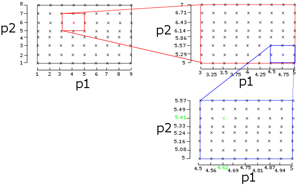

# Parametrisation of the OCV curve

This chapter explains how to use the code implemented for finding the parameters of the model such that it can fit your data.

## Overview of the parameters in the model

The main goal of the code is to enable fast simulation of battery degradation using the SPM. Two sets of parameters for the SPM (for two different cells) have been provided. If users want to simulate different cells, they have to provide the parameters of the SPM. The parameters can be grouped in three classes:

- **OCV parameters:** these include all parameters needed to produce an OCV curve. This includes the half-cell OCV curves, initial lithium concentrations, size of the electrodes, etc.
- **Characterisation parameters:** these include all parameters needed to calculate the voltage while the cell is cycling (constant current and/or constant voltage). This includes the diffusion constants, rate constants and resistance, etc.
- **Degradation parameters:** these are the parameters of the different degradation models which will determine how a cell degrades over its life time.

For the first two groups, some basic code is provided to aid users with parametrisation. The degradation parameters have to be found using manual trial and error by the user.
This chapter explains the code provided for the parametrisation of the OCV curves.

## What is implemented? 

If the user can supply half-cell OCV curves and the full-cell OCV curve, there are functions implemented which will find the values of the initial lithium concentrations and the amount of active material (which determines the size of the electrodes). All the code is implemented in determineOCV.cpp (and the corresponding header file).

For a given combination of the parameters (initial Li concentration and amount of active material), the OCV curve of the cell is simulated [using the user-supplied half-cell OCV curves]. This curve is then compared to the OCV of the cell which was also supplied by the user. The difference between both indicates how well this combination of parameters fits the data. The code implemented tries to find the combination of parameters which minimises the error.

The parameters are found using a hierarchical brute force search. *Brute-force* means that we try all possible combinations of parameters and we select the set with the lowest error between the OCV curve simulated and measured. *Hierarchical* means you iteratively refine the search area. You start with a very large search space and take large steps to limit the number of combinations. Then on this large and coarse *grid* you find the best combination and for the second search you *zoom in* on the area around this best combination. The algorithm is illustrated on the graph below for the case where we try to fit 2 parameters (p1 and p2). In the highest search level, we define a large range (1 < p1 < 9 and 1 < p2 < 8) with a large step size (1 for both). We simulate all combinations (indicated by ‘x’) and calculate the error for each of them. We then select the combination with the lowest error (‘x’) and refine the search grid around this point for the second search (the red box). This procedure is repeated for all lower levels, until we find the parameters with the lowest fit in the lowest level (‘x’).

{:width="80%", :align="center"}

If the problem is convex, this procedure will converge to the optimal combination of parameters. The upper bound of the error can be calculated using the equation below.

$$ |e| \leq \frac{dp}{2}(\frac{2}{s-1})^{(l-1)} $$

where:
- $$ \vert e \vert $$ the absolute value of the error on the value of the parameter
- $$dp$$ the initial step size in the search space for the parameter (1 in the example from the graph above)
- $$s$$  the number of steps in one search level (9 for p1 and 8 for p2 in the example from the graph above)
- $$ l $$ the number of levels in the hierarchical search (3 in the example from the graph above)

Unfortunately the parametrisation problem is not convex so the algorithm can converge on a local minimum instead of the global parameters. Therefore, the outcome should always be verified by the user. Trying with different settings (e.g. a different initial step size) can lead to a better fit.

The user should only interact with the function `estimateOCVparameters`. The first code block ‘1 user input’ groups the parameters which users have to supply:

- **OCV curve of the cathode:** this must be a `*.csv` file with two columns. The first column must give the lithium fraction in strictly increasing order, starting from 0 and ending at 1. The second column must give the voltage (vs li/li+) of the cathode at the respective lithium fractions. (as example the user can have a look at the file `OCVfit_cathode.csv` which is provided along with
the code). In the C++ code, the user has to supply the name of the csv file and the number of rows in the file.
- Exactly the same must be done for the anode (example file `OCVfit_anode.csv`)
- The OCV curve of the cell must also be supplied in a `*.csv` file. The first column must be the discharged charge in Ah (not the state of charge), starting at 0 (so a fully charged cell), strictly increasing and ending at a positive value when the cell is fully discharged (which should be similar to the cell capacity). The second column must give the OCV of the cell (so the first value should be close to the maximum cell voltage and the last value should be close to the minimum cell voltage). The example file is called `OCVfit_cell.csv`. In the C++ code, the user has to supply the name of the `*.csv` file and the number of rows in the file.
- Then the user has to give the name of two `*.csv` files in which the results will be written (if the file already exists, its content is overwritten).
- Finally, the user has to specify the maximum lithium concentration in each electrode. `cmaxp` for the cathode and `cmaxn` for the anode (in mol per cubic meter). This concentration will be used to relate the lithium fraction to the actual lithium concentration (and thus to the change in concentration for a given current).

In the second code block *2 define the search space for the fitting parameters*, the user has to give a range in which the algorithm should search. For every parameter, a minimum and maximum value has to be given, as well as the step size (from this the number of steps for that parameter can be calculated). It is recommended to use a wide range with a large step size since this is a combinatorial problem (the total number of combinations is the product of the number of steps of every parameter, so if you take 10 steps for each of the 4 parameters we have to check 10,000 combinations). The hierarchical search will refine the search space to a smaller range and smaller step size. In total, there are 4 parameters

- `AMp`/`AMn`: active material on the positive/negative electrode.
- `sp`/`sn`: initial lithium fraction in the positive/negative electrode (i.e. the lithium fraction in the cathode/anode when the cell is fully charged). The value must be between 0 and 1 (because it is the lithium fraction).

In code block 3, the user can specify the number of search levels to use, the more levels the better the fit will be (but the longer the search will take). Then the hierarchical search algorithm is called, which will find the best combination of the 4 parameters.

In code block *4 write outputs& the results are processed. The value of the 4 parameters and the remaining error are written to a `*.csv` file. Then the OCV curve of the cell is simulated (with these 4 parameters) and written to a csv file. The MATLAB function `readEstimateOCV.m` will read this simulated OCV curve as well as the (user-supplied) measured OCV curve and plot both. The user can then check how well the simulation fits the data. If the outcome isn’t great, you can try with a different initial search space (e.g. a slightly smaller step size) and the outcome might be better.

Finally, the 4 fitted parameters have to be translated to all the parameters needed by the SPM. The SPM is *overparametrised*: several combinations of parameters will produce the same result. The amount of active material is the product of three parameters (electrode thickness, electrode volume fraction and electrode surface area). So no unique values for the individual parameters can be obtained from the SPM (e.g. doubling the electrode thickness and halving the volume fraction will produce exactly the same result).

In the implemented code, the value of 2 of them is chosen arbitrary (the volume fraction is set to 0.5 and the electrode surface area to 0.0982 square meter) such that the value of the third (electrode thickness) can be calculated using the fitted *amount of active material AM*. If the user wants a different value for any of these parameters, this can be changed in code block 4.
The value of the individual parameters is then also written to the csv file.

## Running

In the main-function defined in `main.cpp`, most variables (cell type, degradation model specification, etc.) are all ignored. The only thing left to do, is need to uncomment (remove the two backslashes in front of the lines) the line which calls estimateOCVparameters in the code block ‘parametrisation function calls’. Ensure that all other function calls are commented.

Then build the code and run it as indicated in the [Getting started](../1_getting_started/). With the settings in the code release, it should take couple of seconds.

## Interpretation 

Two `*.csv` files with results are written
- OCVfit_sim.csv contains the simulated OCV curve of the cell with the parameters which gave the best fit. The MATLAB script `readEstimateOCV.m` reads this `*.csv` file as well as the `*.csv` file with the measured OCV curve and plots both. You can then see how good the fit actually is. If you are not happy, you can rerun the search with different parameters or with a different metric for the error (see [Editing](#editing)). The columns in the `*.csv` file are
    - The simulated discharged charge in Ah
    - The simulated cell OCV
    - The simulated anode li-fraction
    - The simulated anode voltage (vs Li/Li+)
    - The simulated cathode li-fraction
    - The simulated cathode voltage (vs Li/Li+)
- `OCVfit_parameters.csv` contains the values of the parameters of the best fit (as well as the input parameters which were used to generate this result). You can have a look and see if the values are realistic. If you are happy with the fit and the values of the parameters, you have to transfer the parameters to the C++ code.
    - If you want to fit the characterisation parameters (rate and diffusion constants), you have to copy the values of the parameters to `fitCharacterisationAtReferenceT` in `determineCharacterisation.cpp` (see [Characterisation Parametrisation](../3_using/5_character_parametrisation.html)). Don’t forget to also update the half-cell OCV curves in the cell constructors.
    - If you want to use the new parameters for the cycling- or degradation simulations, you have to change the values of the parameters in the constructor of the cell type you will use for the simulation (in `cell_KokamNMC.cpp`, `cell_LGChem.cpp` or cell_user.cpp). At the following locations:
        - Name of the csv file with the cathode OCV curve (`namepos`): to the variable namepos in the code block ‘OCV curves’ of the constructor
        - Name of the csv file with the anode OCV curve (`nameneg`): to the variable nameneg in the code block ‘OCV curves’ of the constructor
        - Length of the csv file with the cathode OCV curve (`np`): to the variable OCV_pos_n in the code block ‘OCV curves’ in the constructor
        - Length of the csv file with the anode OCV curve (`nn`): to the variable OCV_neg_n in the code block ‘OCV curves’ in the constructor
        - Maximum li-concentration in the cathode (`cmaxp`): to the variable Cmaxpos in the code block ‘maximum concentrations’ in the constructor
        - Maximum li-concentration in the anode (`cmaxn`): to the variable Cmaxneg in the code block ‘maximum concentrations’ in the constructor
        - The capacity of the cell (`cap`): to the variable nomCapacity in the code block Cell parameters in the constructor
        - The maximum cell voltage of the cell (not a separate variable in `determineOCV` but it is the first value of the measured OCV curve and is written in the output csv file `OCVfit_parameters.csv`): to the variable Vmax in the code block Cell parameters in the constructor
        - The minimum cell voltage of the cell (not a separate variable in determineOCV but it is the last value of the measured OCV curve and is written in the output `*.csv` file `OCVfit_parameters.csv`): to the variable `Vmin` in the code block Cell parameters in the constructor
        - The electrode surface area (`elec_surf`): to the variable `elec_surf` in the code block ‘geometry’ in the constructor
        - The volume fraction of active cathode material (`ep`): to the variable ep in the code block ‘Initialise state variables’ in the constructor (note do NOT put the value in the variable Ep (with capital E) in the code block of the stress parameters, Ep is the Young’s modulus)
        - The volume fraction of active anode material (`en`): to the variable en in the code block ‘Initialise state variables’ in the constructor (note do NOT put the value in the variable En (with capital E) in the code block of the stress parameters, En is the Young’s modulus)
        - The thickness of the cathode (`thickp`): to the variable thickp in the code block ‘Initialise state variables’ in the constructor
        - The thickness of the cathode (`thickn`): to the variable thickp in the code block ‘Initialise state variables’ in the constructor
        - The lithium fraction in the cathode at 50% SoC (`fp[1]`): to the variable fp in the code block ‘Initialise state variables’ in the constructor
        - The lithium fraction in the anode at 50% SoC (`fn[1]`): to the variable fn in the code block ‘Initialise state variables’ in the constructor

## Editing

### Change the OCV curves (half-cell or full-cell) or maximum concentration

The OCV curves have to be supplied in csv files which have to follow a specific format (see above). You can make new csv files with your new OCV curves and copy these files to the project folder. You then have to change the parameter in the C++ code which gives the name of the `*.csv` file with the respective OCV curve (namexxxx) and the parameter which indicates the length of the OCV curve (the number of rows in the csv file, nx). This has to be done in code block ‘1 user input’ in the function `estimateOCVparameters` in the file `determineOCV.cpp`.

At the same location, you can also update the values of the maximum lithium concentration in each electrode.

### Change the search algorithm

There are two main things you can change in the algorithm: the settings and the error calculation
- *Settings:* changing the initial search space and number of levels will lead to a different fit. Adding more levels in the search hierarchy (`hmax` in code block 3 in the function `estimateOCVparameters` in the file `determineOCV.cpp`) will improve the fit by refining the values of the parameters a bit more. They should still be close to the original fit, just with more digits (because we converge to the same point but getting a bit ‘closer’ to the local minimum). Of course, this will increase the calculation time. You can also change the initial search space (minimum value, maximum value, step size) for every parameter individually. This might cause the algorithm to converge to a different point altogether (finding another local minimum) so the new best fit might be quite different. If more steps are taken (decreasing the step size or increasing the range), the calculation time will increase as well.
- Another important factor is how the error between the simulated and measured OCV curve is exactly calculated. This is done in the function `calculateError` in the file `determineOCV.cpp`. The currently implemented code uses the *root mean square error* between both. You interpolate the simulated OCV curve at the measured points (to get the values at the same x-points), and take the difference between both y-values. One important factor is how you account for a difference in capacity (e.g. what if the measured OCV curve goes until 3Ah while the simulated OCV curve already reaches the minimum voltage at 2.7Ah?). The implemented code gives the user two options for ‘extending’ the simulated OCV curve: by either adding points at the lowest voltage or by adding points at 0V (i.e. you add points with x-values from 2.7 to 3 and as y-values Vmin or 0). The latter case penalises a difference in capacity quite a lot. Note that this also is ‘asymmetric’: if the simulated curve is extended, the ‘errors in the extra region’ are Vmeasured – V_added (where the latter is Vmin or 0); but if the simulated curve is ‘longer’ (e.g. the measured curve goes to 3Ah while the simulated curve goes to 3.2Ah), there is no need to extend either curve because we use the x-values of the measured curve (so the error is only calculated in the range 0 to 3Ah) and the points simulated from 3Ah to 3.2Ah are simply ignored. Users are free to implement their own error-metric which is of course going to affect the ‘best’ parameter fit.

### Trying out your own parameters & manual parametrisation

In case you already have the OCV parameters and want to check how well they fit data, or if the automatic parametrisation failed and you want to do it manually, you can use the CCCV-function from `cycling.cpp`. A full explanation is in [Cycling](../3_using/2_cycling.html) section but here is a short summary:
- Put your parameters in one of the constructors of a Cell-subclass (e.g. `Cell_user` in `cell_user.cpp`). This includes linking to the `*.csv` files with your half-cell OCV curves etc. You have to give values for all the parameters mentioned above, they all have an impact on the OCV behaviour. (see the subsection ‘C how do you interpret the results’ for an exhaustive list of all parameters you have to change). But things like diffusion constants, rate constants, etc. can be ignored).
    - For the initial lithium fractions, the comments in the code specify you have to give the fractions at 50% SoC. In fact, you can use the fractions at any SoC you like. There might be a problem if you choose fractions at 100% SoC but due to a discretisation error (or because your values are slightly wrong), the initial cell voltage might be just above the
maximum voltage (e.g. 4.2001 instead of 4.2) and the code will throw an error. In this case, there are two things you can do: either you set the lithium fractions to a slightly smaller SoC; or you can increase the maximum voltage of the cell (e.g. set it to 4.25V). This latter approach will mean the OCV curve is simulated from your new maximum voltage (4.25) but then you can simply discard the part above the ‘real’ maximum voltage. Note that exactly the same might happen if you use lithium fractions of 0% SoC (voltage below the minimum cell voltage, so either change the li-fractions to a slightly higher SoC or decrease the minimum cell voltage).
- In the function CCCV in `cycling.cpp`, you can choose the cycles you want to simulate. Set the temperature, Crate of the CC phase, limit current of the CV phase and voltage limits for the cycle(s) for which you have data. To simulate a OCV-curve, simply set the Crate to a very low value (e.g. C/500), the simulation should only take a fraction of a second any way. (There is no code implemented for a real OCV-curve, but the pseudo-OCV curve with a very low current value is a very good match).
- In the main function in `main.cpp`, set the value of `cellType` to the cell for which you have set the parameters (e.g. 2 for Cell_user). Set the prefix to some value you will recognize (and to a new value to avoid overwriting data). It doesn’t matter which degradation models are included in the simulation since we don’t care about degradation at this point. Uncomment the line where you call the function CCCV (by removing the double backslash at the start of the line). Comment all other function calls (by adding two backslashes in front of all other lines in the code blocks with function calls).
- Build and run the code
- The data of the simulation is written in the newly-created subfolder (called ‘xx_yy_CCCV’ where ‘xx’ is the prefix you had chosen and ‘yy’ the degradation models.
- You can use the MATLAB script `readCCCV.m` to plot the voltage, temperature, etc. of the cell (you will have to change the value of the prefix and degradation identifiers in the MATLAB script too). You will have to add your data to this plot yourself. The `*.csv` file also has the data about the electrode potentials if you need it (then you can see which part of the half-cell OCV curves are actually being used), but at the moment this data is not plotted by MATLAB.
- You can then change the values in the cell-constructor and simulate again (remember to change the prefix in main to avoid overwriting your original results). Then you can manually try to find the correct parameters yourself.

### Changing other parameters

You can change other parameters of the model as well. There is no code to support those changes, but you can set different values in the constructor of the Cell-subclass you are using (see ‘trying out your own parameters...’). Most things you can change without many problems (e.g. the density of the cell, the entropic coefficient, etc.). You only have to be careful with changing the radius of the particles.

It is not recommended to change the value of the radius because you can achieve the same effects by changing the other parameters in the model (e.g. for the diffusion behaviour, it is R/D which matters so you can change the diffusion constant instead; similarly for the amount of active material in which case you can change the thickness or the volume fraction instead). The reason why changing the radius is more difficult is because the spatial discretisation depends on the radius (i.e. the location of the nodes changes if the particle has a different size).

If you want to change the radius, you therefore have to re-compute the spatial discretisation. You can do this with the MATLAB script `modelSetup.m` as is explained in [MATLAB setup](../2_overview/4_matlab_setup.html). You have to change the value of the radius there, and run the scripts. This will write `*.csv` files with the new discretisation. If you then also change the values of the radius in the C++ code, it should automatically read these new values and the code should work.

Note that there can only be one spatial discretisation at any given time (the `*.csv` files are overwritten when a new discretisation is calculated). This means it is not allowed to use two cell types with a different radius at the same time (which is why both the high-power Kokam and the high-energy LG Chem cell have the same radius). So if you change the radius is one cell type (and therefore also in MATLAB and in the written csv files with the discretisation), the code will throw an error if you try to use another cell type which still has the old radius.

### Note on numerical stability of changing the radius, diffusion constant or thermal parameters

Sometimes, changing certain parameters by large amounts might lead to errors in the code. This is the case for the radius, the diffusion constant, and all the thermal parameters (cooling, density, heat capacity, etc.). The reason is that the time integration of the diffusion PDE or thermal ODE becomes unstable (i.e. numerical errors blow up to infinity and the value of parameters becomes inf or NaN (not a number). (note: the inf or NaN might appear somewhere else in the code, e.g. in the voltage). In this case, there are a couple of things you can try:

- Reduce the time step: the smaller the time step, the more stable the code. So the first thing to do if you get this problem is to reduce the time step. This will help both for the diffusion and the thermal problem
- Increase the number of discretisation nodes (this will only help if the diffusion equation is the problem; the thermal ODE is not affected). You can do this by increasing the value of nch defined on top of `state.hpp`. You will also have to rerun the MATLAB scripts which calculate the spatial discretisation. 
- Change the time integration method. The code uses (first order) forward Euler time integration, which is known to be not very stable. There are more stable time integration schemes (e.g. Runge Kutta schemes) but they are not implemented. To change the time integration scheme, you have to adapt the function `ETI` in `cell.cpp`. The comments clearly state where the time integration is done (first calculating the derivatives and then stepping forward in time using forward Euler), and these lines should be replaced with your new time integration scheme.
