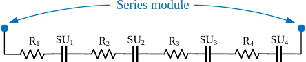
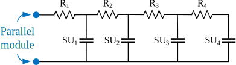

# Individual Classes

### StorageUnit

Defines the functions which must be implemented by all other classes. They can be grouped as;

- Electrical / chemical: e.g. calculating the voltage, getting the voltage limits, etc.
- Thermal: e.g. calculating the new cell voltage for a given heat exchange with adjacent things
- Data storage: storing certain data from the simulation which can be plotted later
- Auxiliary: e.g. getting the ID string of this StorageUnit, getting the parent (Module to which this StorageUnit is connected)

Note that there are two voltage limits: `Vmin`/`Vmax` and `VMIN`/`VMAX`. The former are the regular voltage limits outside of which an SU should not be used (e.g. 2.7V and 4.2V). However, due to the discrete time stepping and imperfect external functions (e.g. `CV` in `Cycler`), these limits might occasionally be exceeded by a small margin. SU will report to higher levels that they have exceeded these limits, but they will keep working.

`VMIN` and `VMAX` are the ‘safety cut-off’ limits. Under no circumstance should these be exceeded, for instance because you risk going outside of the OCV curve (e.g. the surface concentration becomes <0 or > 1). If `SU` exceed these limits, they throw an error and the simulation is usually interrupted.

### Cell

Is an Interface class for all Cells. 

`Cell_Bucket` also implements all the data storage functions. Cells store their current, voltage, SoC, T, total cumulative charge and energy throughput and total cumulative time. Depending on the settings in `settings.hpp`, they store these value after x number of time steps and then write long csv files [note that this takes a lot of time and generated huge amounts of data]. Alternatively, they can store the ‘statisticis’, i.e. keep some histogram of what fraction of time they were at a given current, `voltage`, `SOC` or `T`

### Cell_Bucket

Implements `StorageUnit for a single cell. It uses the linear ‘bucket model’ (OCV is a linear function of the SoC which is the integral of the current). There is no degradation, and no thermal model (i.e. temperature is constant).

### Cell_ECM

Simulates an equivalent circuit model for a single cell. Again, no thermal model and no degradation. Data storage is not implemented (i.e. the implementation from Cell will be used). Currently, it only has one RC pair which will be generalised to `N` RC pairs in future. 

### SPM Cell

This is a large class which implements a cell according to a single particle model. It includes a thermal model (simulating how a cell heats up due to internal heat generation and heat exchange with the cell’s environments, the former is calculated by the cell, the latter is given by the parent `Module`), and various degradation models.

It extends the data storage a bit by keeping track of some states related to the degradation.

### Module 

This is an _abstract class_, i.e. some functions are implemented while others are only defined (and implementations are given in the child classes) to simulate a generic module. The functions which have the same implementation for series and parallel connected cells are implemented in Module (such as thermal model). Functions with different implementations (e.g. `Module::V`) are only defined here in Module.

The most important field is an array of StorageUnits. These are the elements connected to this module (and are referred to as the ‘child Sus’). Due to the pointers and polymorphism, the code works for both cells (i.e. cells are connected in series/parallel to form this module) or other modules (i.e. you connect different modules in series/parallel to form a higher level module). Because all functions of SU are defined as virtual, the implementation of the most specific class will be called at runtime (e.g. if the module consists of SPM cells and you call `SU[i]->V()`, then the function `V()` from `Cell_SPM` will be executed).

Most implemented functions are relatively simple, e.g. getting the voltage of all the child SUs or getting an array with the state of all child SUs. The most important implemented function is the thermal model. For every child SU, the module will find the adjacent SUs and pass on their temperatures and thermal resistances to the child SU, such that it can calculate its thermal balance. This has to be done because child SUs don’t know their neighbouring SUs, so the Module needs to tell them _you are surrounded by these elements_ so the heat exchange between different elements can be computed. Note that to ensure consistency, child SUs don’t update their temperature until all heat exchanges have been computed (else heat exchange between two elements would be not symmetrical).

Modules also cool their child SUs. For that, they have an instance of a `CoolSystem`. The details are given later, but basically the coolsystem has a temperature, thermal mass and a controllable convective cooling constant. When informing child SUs of their neighbouring elements, the coolsystem acts like a neighbouring element at lower temperature and with a low thermal resistance, such that heat will flow from the cell to the coolsystem. The temperature of the coolsystem is only updated after all child-SU temperatues have been computed, so all child SUs get the same amount of cooling independent on their position in the module. The only exception are the 1st and last child SU, which share one surface with a cell and another with the Module. So the heat exchange between those two cells and the module is the sum of the (convective) cooling and the (conductive) contact on one side of the cell.

Modules can store cycling data (current, voltage, temperature at every time step), but no _usage statistics_. This can be implemented if desired. However, the storeData function will invoke the storeData function on all child SUs, as well as on the coolsystem (both of which can store statistics).

A final piece of functionality added are contact resistances. Every cell can be connected to this module with a certain additional resistance, although the implementation is different for series vs parallel modules.

### Module_s
This class defines a series-connected module. This means that the module voltage is the sum of the voltages of each child SU, while all child Sus have the same current. All functions are fairly straightforward. See below about multithreading.

Contact resistances are in series with the cells as indicated below (where `R_i` is contact resistance i, and SU_i is child SU i). Note that each SU has its own resistance (which will be in series with the contact resistance)

{:width="70%" }

Time integration in modules works by calling the time integration functions of the child SUs (which will eventually end up in the time integration functions of Cells or SPM cells). Time integration can take multiple time steps at once, which means we allow every child SU to take this number of time steps _on its own_ before returning to the module code. So if we want to take 10 time steps in a series module, we first take 10 time steps in SU1, then 10 steps in SU2, etc. until we have taken 10 time steps in the last SU.

Currently multithreading option is not working but when it works time integration of the different child SUs will be completely independent of each other, so a new thread is created per child SU, and the child SU is integrated over N time steps on that separate thread. When each child has completed its time integrations, the code returns to the main thread. If an error happens during time integration on a separate thread, a flag is set in the Module, such that after returning to the main thread we know something went wrong and can deal with it appropriately.

Multithreading does not make sense for small modules (modules made of cells) since the overhead to create a thread, share memory locations, etc. is much larger than the computational requirement of integrating a single cell for 10 steps. However, if you have hierarchical modules (modules made of modules made of … made of cells), then using the multithreading at the ‘outer’ module will speed up the calculation dramatically (since 10 time steps of its child SUs might involve taking 10 time steps on hundreds or thousands of cells).

### Module_p

This function defines a parallel-connected module. This means that the voltage of all child SUs has to be the same (or within a defined tolerance), while the module current is the sum of the currents to each child SU.

Contact resistances are in parallel branches in the module. The terminals of the parallel module are before the first cell as indicated below. This means that the entire module current goes through R1, the current through R2 is the sum of the currents through SU2, SU3 and SU4. Similarly for all resistances. Note that an SU will have its own resistance (which will be in series with the OCV of the SUs). 
In reality, there might also be resistances at the other side of the module (i.e. on the bottom horizontal line in the circuit below), but these can be lumped into the resistances on top since exactly the same current will pass through them.
Note that cell currents are always the _total_ current passing through that cell (i.e. the sum of the current _to the module terminal_ and the current _to the other cells to balance the voltages_).

{:width="70%" }

To ensure that the voltages of the child-SUs are always the same, the code follows a sort of PI-controller behaviour. If the voltage of one SU is too large, the code will increase its current (i.e. charge less or discharge more) and decrease the current of the SU with the smallest voltage with the same amount. This ensures that the total module current remains the same (because current is swapped) and that the voltages converge over time. This implementation was found to be much faster and more robust than explicitly solving the equations to equalise the voltage.

There are three functions with a significant functionality:

1. **redistributeCurrent:** as the name implies, this function will redistribute the current flowing in the total module to the different child SUs in order to end up at the same voltages. This function works a bit like a PI controller, if the voltage of a cell is too large, its current is increased (i.e. the cell current is increased by a fraction which is a function of the error on the voltage). To ensure the total module current remains the same, the opposite current change is done to the cell with the lowest voltage.	
Note that it is not exactly a PI controller, because the amount of current changed is not directly a function of the voltage error. This is necessary because the OCV curve is very steep at some points while almost flat at others (so the same change in current will have a very different effect on the voltage depending on where in the OCV curve you are), cell resistances are not constant, and different cells can be at different states (e.g. a module with 1 degraded cell and 4 ‘good ones’, then the same current change in the degraded cell will have a much larger effect than the same change in a ‘good’ cell.	
Instead, the amount of current swapped between the cells with the highest and lowest voltage is a small fraction of the cell current. The fraction is small enough to ensure stability in almost all cases, but it does mean that if the error is large you will need a few iterations to reach the appropriate correction. The fraction will however decrease if the voltage error decreases, but according to a pre-defined step-wise approach, which ensures convergence and stability in almost all cases.

2. **setCurrent:** This is the function to change the module current, which obviously needs to be done carefully. The approach in this function is simple: allocate the current uniformly and then call `redistributeCurrent()` to equalise the voltages. This works well if the differences between the child SUs are small, but it might fail for large differences (e.g. one very degraded cell with 8 good ones, then giving 1/9th of the total current to the degraded cell might push it over its voltage limit). In this case, we swap to the approach from the function below (setI_iterative). setI_Iterative is currently removed and setCurrent is equipped with a better `redistributeCurrent_new()`. 

<!-- 3. **setI_iterative:** This function is currently removed! This function is more cautious than the previous one, but also takes much longer to compute. It follows a three-step approach (the last one of which is an iteration) to distribute the current.
- Estimate the resistance of each cell: assume the current would split equally between all cells, distribute half the needed change in current. E.g. our module has 2 cells which initially each have a current of 1A, and we are trying to set the module current to 6A; in this example we set the current of each cell to 2A. Then get the voltage of each child SU, and use this value to estimate the resistance (dV/dI). Note that this resistance is different from the DC resistance of an SU because it will include kinetic (and surface concentration) effects of SPM cells.
- Revert back to the initial situation (i.e. every cell has its original current of 1A). Then distribute half the current proportional to the resistance of each cell (the current divider in a parallel circuit). So in our example, cell 1 might get 1.95A and cell 2 might get 2.05A if the resistance of cell 1 is larger than the resistance of cell 2.
- Iteratively allocate a fraction of the remaining current to the cell with the lowest voltage (if charging) or largest voltage (if discharging). Keep doing this until we have allocated all remaining current (note that in every iteration the absolute value of the current we change is smaller). E.g. in our example, we are discharging and cell 2 has a current of 2.05A but its voltage is still a bit larger than the voltage of cell 1; then increase the current of cell 2 to 2.06A. Now the voltage of cell 1 is larger, so increase its current from 1.95 to 1.959. Etc until the total current is 6A. -->

Time integration in parallel modules is similar to series modules, i.e. you can take N time steps at once, which is done separately for each child SU potentially on different threads. The voltage equalisation is only done after N steps (i.e. only after time integration we call redistributeCurrent), so the voltage constrained is not imposed between those N steps.

### Battery

The Battery class represent a _container_. It has one module (which has all cells connected to it), an inverter to convert the variable DC voltage to a fixed AC voltage, and an HVAC cooling system.

In most ways it behaves like a module, and most functions are direct pass-throughs (i.e. simply invoked on the Module). Note in particular that the getI() and getV() functions return the values of the Module, i.e. the (variable) DC voltage and DC current. This must be so because Battery is a type of StorageUnit, so e.g. we must be able to charge at a given current to a given voltage (and if getV returns the constant AC voltage, then the charge will never stop).

The converter is an instance of the class Converter, and the only function it has is to calculate the losses in the converter. These losses are not taken into account when calculating the current and voltage (which as said are the DC current and voltage) but they are stored internally such that if desired, the efficiency from the AC side can be calculated. The heat generated by the converter losses is included in the thermal model of the Battery.

The thermal model of the Battery is very similar to that of a Module, with three differences:
- There is an extra source of heat generation from the converter (as well as the heat from the Module).
- A Battery cannot have a parent or neighbouring units. It is a stand-alone unit which only exchanges heat with its Module
- To cool the Battery, it must have an `HVAC Coolsystem`. It is like a coolsystem, but with the addition of an AC unit which can exchange heat with the environment. A conventional coolsystem must be cooled by the parent of the module to which the coolsystem is connected. Since a Battery does not have a parent, this coolsystem must be able to cool itself. See Coolsystem_HVAC for more info.

### CoolSystem

CoolSystem is the base-class for all cooling systems. Coolsystems are used by Modules to cool the child-SUs connected to the module. Coolsystems have a thermal inertia, coolant flow rate and cross-section, all of which scales linearly with the number of Cells ultimately connected to the module. The flow rate and cross section determine the speed of the coolant, which in turn determines the convective coolant constant to the child SUs.

CoolSystems can control the flow rate (e.g. by controlling a fan), which will increase or reduce the cooling to the child SUs. They also keep track of the operational power they require, which is the energy required to speed up the coolant to the given speed over the given cross section. Currently, 5 control strategies are implemented:
1.	Always on at full power
2.	On/off with static temperature limits (e.g. on at 20 degrees, off at 35 degrees), where the temperature we use is the temperature of the hottest child SU (ie the local temperature)
3.  On/off with static temperature limits but based on the hot-spot temperature “behind” this CoolSystem (i.e. of all cells ultimately connected to this Module, what is the hottest cell). 
4.  Proportional to the temperature of the hottest child SU (i.e. local temperature)
5.  Proportional to the temperature of the hottest cell ultimately connected to this Module

if this `Coolsystem` is at the bottom layer (i.e. its `Module` has cells), this is the same as strategy 2. But if this Module is a higher level one (i.e. its child SUs are also Modules), then strategy 2 acts based on the temperature of the Modules while 3 goes to the Cells.
The _local_ control (i.e. 2 and 4) must use the temperature of the children and not the temperature of the coolsystem because if the coolsystem is off, it won’t cool the cells so it won’t heat up itself. Therefore if we would use the temperature of the coolsystem, it would never switch on and the child SUs would overheat.

A `Coolsystem` only cools the child SUs and must be cooled by the `Coolsystem` of the parent of the Module to which it is connected. I.e. they only extract heat “from below” but accumulate it in their own thermal mass until the layer “above” them will extract their heat. Therefore, the ‘top level Module’ (i.e. one without a parent) cannot have a Coolsystem, since it would just keep heating up. This top level must have an HVAC_Coolsystem (see below).

The Coolant in the coolsystem has a temperature, which is the temperature of the Module (or rather, the temperature of the module is the temperature of its coolsystem). The temperature will change due to heat exchange with the child SUs, neighbouring Modules and parent Module.

CoolSystems store usage statistics of their temperature, operating power, flow rate and the amount of heat they evacuated from their children.

### CoolSystem_open

This is a simplification of the Coolsystem, basically by saying there open space between the parent of this Module and its children (i.e. the children of the Module are cooled by the CoolSystem of the parent of this module). Therefore, it can only be used by ‘middle level’ Modules (i.e. Modules with both children and a parent).

The coolsystem acts like an ‘aggregator’ of the child-SUs by having a large convective cooling constant. Therefore, it will heat up to the same T as the children, be cooled by the parent, and then pass on this cooling to the children.

An open coolsystem does not require operating power (since it has no fan).

### CoolSystem_HVAC

This child-class extends a conventional `CoolSystem` and must be used by the top-level Module (or a Battery), which does not have a parent. Therefore, this coolsystem can cool itself by exchanging heat with the environment.

It has an AC unit to cool down itself from the environment. The amount of cooling we get from the environment can be controlled similar to the controls of the fan (but note that here we control the cooling power, not some flow rate). The heat exchange with the environment can happen in two ways:
- If the environment is cold enough, we simply suck in a volume of cold air corresponding to the cooling power we want. The operating power of the AC unit is then the power needed to suck in this air over the given time period and cross section (similar to how the operating power of a conventional CoolSystem is calculated)
- If the environment is too hot, we use an active cooling system. This is not simulated explicitly, we just assume we can get a certain amount of cooling, and the operating power is the product of the COP (coefficient of performance) multiplied by the cooling power. Note that this is very inefficient, i.e. you need a lot of power to run it.

On top of all the convention data storage, HVAC systems also store the heat exchange with the environment (i.e. the cooling power from the AC unit) and the operating power of the AC unit. Note that these are stored separately to the heat extracted from the child SUs and the operating power of the fan to cool the child SUs.

### Cycler
`Cycler` implements functions to load a `StorageUnit` with a constant current or constant voltage.

There is a question about what to do with voltage limits of potential children in the SU. E.g. if the SU of the `Cycler` is a series-module, should we stop when one cell in the module reaches a voltage limit (Vmax or Vmin), or do we keep going until the entire module has reached its voltage limit? This is decided by the fied `diagnostic`, which is a Boolean. If it is true, cycling will be interrupted when an individual cell’s voltage limit is reached. This might be preferable, e.g. if you are simply fully charging and discharging a large battery, then you probably are almost fully charged when the first cell reaches its voltage limit so you can just carry on discharging. Therefore, no fault is thrown but the CC or CV function is simply terminated (and reports that this is what happens).

If it is false, you don’t check the voltage limits of individual cells during cycling. However, when a cell reaches a `VMIN` or `VMAX` safety limit, a ‘hard fault’ is thrown (an error is thrown by the cell, which is simply passed on and will probably cause the code to crash unless higher-level functions deal with it).

The main function in Cycler is CC. It has an auxiliary function to apply the specified current to the SU (which will detect if this will exceed a voltage limit and terminate immediately if it does). Otherwise, CC will keep integrating over time until the specified voltage or time limit is reached. As mentioned, if diagnostic is true, then you will also stop as soon as one cell in the StorageUnit reaches its limit.

The function CC also controls the number of time steps taken at once (see Module_s). It will start with one at a time, but if we are still far from any limit, it will be increased to a maximum of 10. As we approach the set limit, we will reduce it back to 1. There are a number of issues to bear in mind in relation to this `N` (number of time steps taken at once):

1. During discharge the OCV curve is very steep so you have to reduce N long before you get to the minimum voltage of a cell. You should do this based on the voltage of the cell connected to the StorageUnit with the lowest voltage (since a small cell-to-cell variation will mean that the weakest cell will already be on the ‘steep’ part while the overall StorageUnit will still be on the flat part)
2. During charge, you can use the total SU voltage since the OCV curve is fairly steep (so small cell-to-cell variations won’t lead to very different cell voltages).
- However, the code will eventually crash if you do a long degradation simulation since some cells will have degraded an awful lot, while others are still fine. In this case, the cell-to-cell difference can be such that the total SU voltage is file, while the cell voltage of the highly-degraded cell has exceeded its limit (and might result in negative lithium concentrations in the anode).
- You can account for the highest cell voltage similar to what is done during discharge. In fact, the code is there but commented out. This is because it significantly slows down the simulation, and only causes problems when you have lost over 50% of capacity.
3.Larger values of N significantly speed up the computation. However, they give two problems:
- Instability: the larger N, the more the voltage will change (because you integrate over a longer time before checking the voltage again). When working with degraded cells, it is possible that this will result in errors in the code, because at some point everything is still fine, but then N steps later you have exceeded voltage limits, or are in negative concentration, etc. This is because you don’t check anything between the N steps (you just solve the diffusion model) so you don’t notice of concentrations go negative or so. A value of N = 10 is fine for fresh cells, but after enough degradation, it will result in errors.
- Inaccuracy: the larger N, the coarser the time resolution for degradation (and thermal) models, which can result in small mistakes. N = 10 with a 2s time step vs N = 1 with a 1s time step gives an error in the remaining capacity of about 10 mAh (0.1%) after 2000 FEC, so this problem seems manageable.

It is therefore suggested that during intermediate simulations, you can leave N at 10. But when you need stable results over the entire lifetime (i.e. after the knee point), you should reduce N, potentially even keep it at 1. The simulation will be much slower (easily 5 times slower) but it might be worth it in these cases.

There is a function to do a CV, but that function should only be used for individual cells and never for compound modules (it isn’t very robust or accurate). Cycler also has a simple function to measure the capacity of a cell by doing a CC cycle at low current.

### Procedure 

Procedure is a very _loose_ class (as in, it has got very few class variables), it more a grouping of functions. In general, Procedure implements degradation procedures as you would program them on a battery tester. There are three types of functions:

***Degradation experiments***
- Cycle Age: continuously cycle a StorageUnit with the same cycle
- Use case age: Simulate more realistic ageing, in this case by doing 2 cycles a day and resting in between

***Auxiliary functions***
- storeThroughput: per ‘action’ (e.g. a charge), store total battery charge and energy, losses in the converter, energy to run the thermal management system
- balance: bring all cells back to the same voltage

***check-up: done both for Cells and Modules. Completely analogous so I only explain the Cells one***
- getCells: from the StorageUnit, extract all the cells and put them in a Vector
- writeInitial: starts a file from scratch and writes identification strings or other overall information of the cells on top of the file
- writeMain: write the states of the cell, and its capacity [not for Modules]
- writeStats: write the usage statistics of Cells

Check-ups take quite some time to do (because you want to know the capacity of every cell of the entire battery). So from the degradation function, you make a copy of the total battery, start a new thread and do the checkup on the copy on the separate thread. This way, the main degradation function can continue straight away. [Note you do need to use some mutex to ensure two concurrent check-ups don’t write data at the same time to the same file].

The following files are written (where xxx is a user-defined prefix):
*Data storage functions are updated and we currently do not use seperators.*

1. xxx_cellStats: This file contains the usage statistics of every cell of the StorageUnit. There is one column per cell (the same order as xxx_checkUp so you can get the cell IDs from there). There is one row per bin value of a histogram.	
The first column gives an identification number indicating which histogram this is (5 = current, 6 = voltage, 7 = temperature). The numbers in the columns indicate the total number of datapoints in this bin. The edges of the bins are not written in this document since they are the same for every cell. Instead, they are written once in the document histogram_edges.csv. If you need to update the edges because you changed the code, run the unit test of the Cycler. The function test_Cycler_writeData will write a number of documents called ‘yyyy_cellStats.csv’. In these documents, rows 109 to 208 contain the edges of the bins so you should copy these rows (and all 3 columns) to the histogram_edges document.
2. xxx_checkUp: this document contains the states and capacities of the cells of all checkups (so you can follow the evolution over time). They have one column per cell, while the first column gives an ID number of what is contained in this row. The first four rows (ID 1) are written by the _writeInitial function and contain:
-	the first row gives the full ID string of the cell which allows you to identify where this cell was (which module of which rack, etc.). 
-	Rows 2 gives the parameter of the cell-to-cell variation of the capacity for this cell (i.e. this cell’s capacity relative to the mean capacity)
-	Row 3 gives the parameter of the cell-to-cell variation of the resistance for this cell (i.e. this cell’s resistance relative to the mean resistance)
-	Row 4 gives the parameters of the cell-to-cell variation of the degradation rate for this cell (i.e. the degradation rate of this cell relative to the mean rate).
Rows with ID 9 (and value 9999999) separates the data from two check-ups
Rows with ID 2 give the total charge throughput of the entire battery at the start of this check-up (so it will have the same value for all cells)
Rows with ID 3 give the throughput values of this cell. There are three of them: the total time (which is the same for all cells), the total charge throughput of this cell and the total energy throughput of this cell.
Rows with ID 4 give the cell capacity as measured by Cycler::getCapacity (i.e. a slow charge-discharge between the voltage limits of the cell).
Rows with IDs 20 to 37 give the states of the cell, excluding the lithium concentration in every node. States are in the order given by Cell_SPM::getStates(). So row 20 is the thickness of the SEI layer, row 21 is the amount of LLI (in As), etc.
3.	xxx_checkModules: This is the file from the Module checkup. The layout is the same as before, i.e. there is one column per module with the first column giving the ID number. Rows 1 to 6 give general information of the Module:
- row 1: full ID string of the Module
- row 2: number of cells ultimately connected to this Module
- row 3 is a separation row
- row 4: is the total time (same for all moduls)
- row 5: is the total heat evacuated by the CoolSystem of this module from the child SUs connected to this module
- row 6: is the total heat absorbed by the CoolSystem of this module (i.e. the energy required to heat up the coolant from its initial temperature to the one it has at the time of the check-up)
Then the rows give the usage statistics of the CoolSystem of the Module. The format is identical to the cell statistics. 	
row ID 5 = temperature 	
row ID 6 = heat extracted from the children of the Module	
row ID 7 = coolant flow rate	
row ID 8 = operating energy for the fan of the CoolSystem	
row ID 9 = the heat extracted by the AC unit (only for CoolSystem_HVAC, 0 otherwise)
row ID 10 = operating energy for the AC unit (only for CoolSystem_HVAC, 0 otherwise)
As for the cells, this document only gives the number of data points in each bin. The edges of the bins are in the document histogram_thermal_edges.csv. If you need to update the values, run the unit test of the Cycler, and the same function as for the cell stats will also produce a file xxx_coolSystemStats.csv. Rows 108 to 207 have the values for the edges (6 columns for the 6 histograms).	
Some of the usage statistics obviously depends on how many cells are connected to the module. E.g. a module of 10 needs to evacuate less heat than a module of 1000 cells. So all statistics apart from the temperature are normalised by the number of cells. E.g. CoolSystems store the amount of heat evacuated per cell connected to its Module, etc. By doing that, we can keep the edges the same for all CoolSystems. But when interpreting the results, you should multiply the values of the edges by the number of cells (which was given in the 2nd row)
4. xxx_throughput: This is a simpler document which gives the throughput values of the cycle ageing per ‘action’. The first column gives an ID number of the ‘action’, e.g. for CycleAge, 1 = CC charge, 2 = CV charge [if any], 3 = CC discharge, 4 = CV discharge [if any]. The second column gives the charge throughput of the entire battery during this action, the 3rd column gives the energy throughput of the entire battery during this action, the 4th column gives the energy required to run the thermal management system of the entire battery during this action (i.e. the operating energy for all CoolSystems and CoolSystem_HVAC) and the 5th column gives the energy losses in the power electronic converter of the Battery (if you only have a Module, then it is 0).	
You can use this document to calculate the efficiency over one cycle. The difference between the energy throughput during charge and discharge gives you the losses in the cells during that cycle, and you can add up the coolsystem operating energy and converter losses during both charge and discharge to calculate the total battery efficiency.
All of these files are read, processed and plotted by the Matlab script readCycleAgeData.m.

