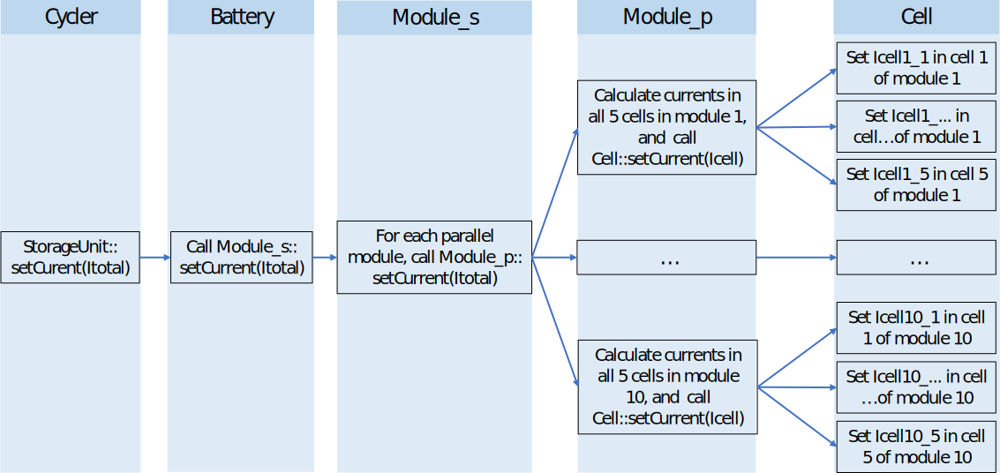
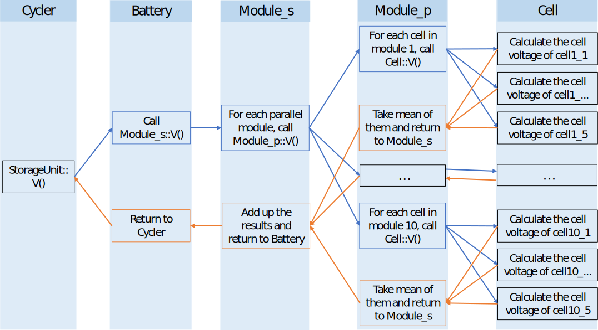
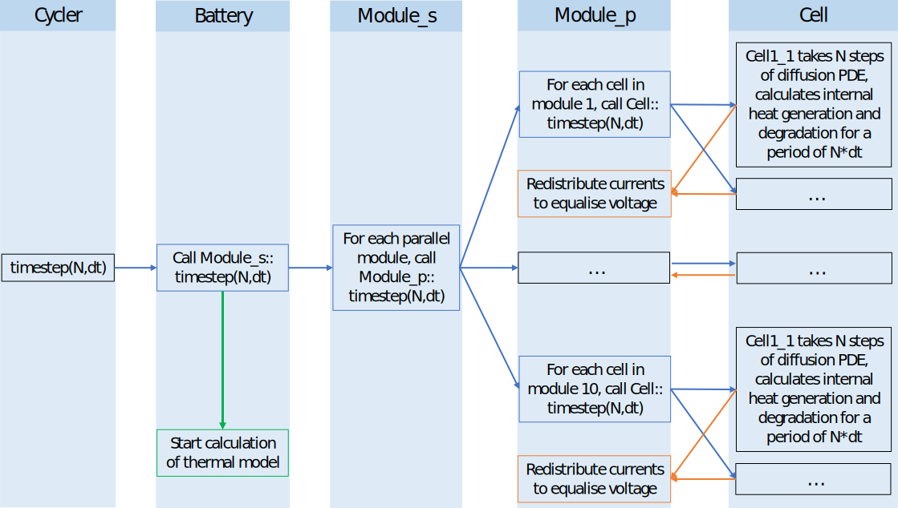
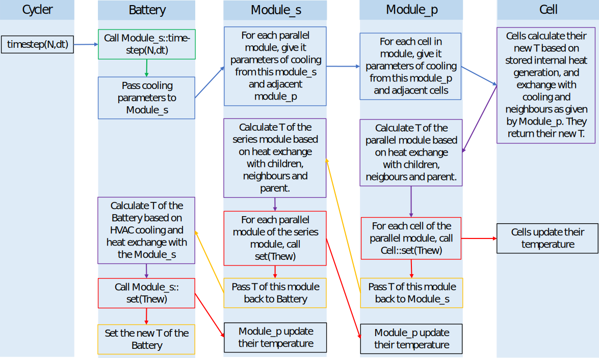
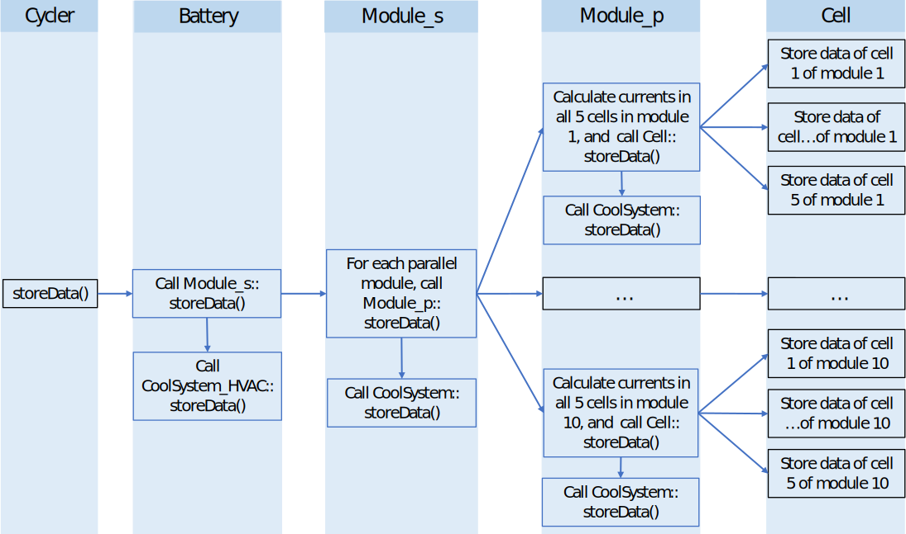

# Overarching Interactions

### Electrical

This section explains how currents and voltages are calculated throughout the battery, as well as how time integration is coupled. The example we give is of 5 cells connected in parallel in a `Module_p`, 10 of those modules connected in series in a Module_s, and that module connected to a Battery.

***Setting a Current***

The `Cycler` will set a certain current to the total Battery (which is the current on the DC bar), and the Battery will transfer this command to its Module. Then Modules are responsible for allocating this current to their ‘children’ (i.e. the things of which this module is made up). So the `Module_s` will set this current to all parallel modules. Then each Module_p will allocate the total current to their individual cells to ensure the 5 cell voltages of each parallel module are the same, while the sum of the 5 cell currents equals the total current. This is graphically shown below, where blue arrows are invoking functions to ‘lower levels’.

{:width="100%" }

***Getting the voltage***

If the `Cycler` asks the voltage of the Battery (e.g. to determine whether to stop charging), the Battery will pass on this request to the Module_s. In a series module, the voltage is the sum of the voltages of its children, so this module will ask the voltage of each Module_p, add them up, return them to the Battery, which in turn passes it on to the Cycler. When each Module_p calculates its voltage, it asks the voltages of the Cells of which it is made up, and takes the average. In Cell, there is a function to calculate the cell voltage as a function of the cell current, SoC, temperature, etc. This is illustrated graphically below, where blue arrows are invoking functions to ‘lower levels’ while orange arrows are returning results to ‘higher levels’.

{:width="100%" }

***Time integration***

Time integration for the electrical model follows a very similar pattern to the setCurrent-function. The `Cycler` instructs the Battery to take N steps of dt seconds each. The Battery will first pass that command on to the Module_S.

When the `Module_s` gets the command to take N steps of dt seconds, it passes this command on to each of the 10 parallel modules connected to it. Each of these Module_p will then pass it on to each of the the Cells connected to it. In the Cells, the diffusion PDE is integrated in time over dt seconds for N times. Then cells calculate the internal heat generation and degradation over the N*dt seconds (so the diffusion model is solved ever dt seconds, while the thermal and degradation models are only resolved every N*dt model).

Once all cells of a parallel module have finished their time integration, the code return to the time integration of the parallel module, which then redistributes the current of its cells to equalise their voltages. Note that this voltage equalisation is only done after N*dt seconds.

If all parallel modules have finished redistributing their currents, the code returns to the series module. The series module does not need to do anything, and returns back to the Battery time integration function. That function will now call the thermal model, which is explained in the next section and indicated by the green arrow in the graph.

{:width="100%" }

### Thermal

The internal heat generation in cells is accumulated during time integration. However, cells cannot update their temperature because they don’t know how much heat they will exchange with neighbours, or how much cooling they will get. So during time integration, they don’t update their temperature.

Once all time integration is done, the code returns to the top level of the StorageUnit, in our case the Battery (but it could also be `Module_s`, `Module_p` or `Cell`). The Battery then starts the computation of the thermal model (indicated in green in the figure below), which is a top-down calculation. 

The concept is relatively straightforward: every _level_ gets as inputs the temperatures and thermal resistances of all neighbouring elements (e.g. cooling from the higher level and heat exchange with neighbours from the same level). This function has the following steps

1.	To each child, pass on the T of this unit along with the cooling constant, as well as the T of the children adjacent to the child and the conductive cooling constant.
- Then children calculate their new temperature, and return this value to our level
2.	Then we calculate the temperature of this level. We can calculate how much heat we exchanged with our parents, neighbours and children because we know the T and heat transfer coefficient to each of them and $$Q = hA (T – T_{\rm neigbour})$$, the sum of all heat exchanges dictates how much this module is going to heat up.
- Note that we got hA and T from our parent and neighbours when this function as called. And we know the hA (from the `CoolSystem` of this module) and T of all our children.
3.	Then we set the temperatures of the children to the value they had given us
4.	Then we return our new temperature to the higher level.

This same process goes on in the `Battery`, `Module_s`, and each of the `Module_p`. Cells are a bit simpler because they don’t have children. When a parallel module informs a cell of h and T of its two neighbouring cells and the T and h of the coolsystem, cells can compute their thermal balance (sum of internal heat generation, heat exchange with two neighbouring cells and with the parallel module). Cells return this new temperature to the parallel module, but only in step 3 of the parallel module, we will update the cell temperature to this new value. This is done because the parallel module needs to compute how much heat it exchanged with the Cell, so all temperatures must remain the same until we have finished this calculation.

Note that it is imperative that Cells or Modules don’t update their own temperature after calculating the new value. Heat exchange is calculated by $$hA(T_1 – T_2)$$. So e.g. the parent will give us $$T_2$$ and we can calculate our own $$T_{\rm 1-new}$$. But if we already set our temperature to this new value, then there will be an error in the code because at some later point in the flow of this function, the parent will compute the heat exchange with its children when it calculates its own new temperature. And this will now be $$hA(T_2 – T_{1_new})$$. In other words, the child thinks the heat exchange is $$hA(T_1 – T_2)$$, while the parent thinks it is $$hA(T_2 – T_{1_new})$$. And this violates the conservation of energy law (heat given away by the parent must equal the heat exchange received by the child). Therefore, we cannot update T1 until after the parent has calculated its own temperature, i.e. in step 3.

The full flow of the program is therefore:
1.	The Battery does not have any parents or neighbours. It knows the convective heat transfer constant (h) of its coolsystem, and passes it to the Module_s, along with the T of the battery.
- `Module_s` will first compute the neighbours of every parallel module. To parallel module_i, the `Module_s` will pass on the T of module i-1 and module i+1, as well as the T of the Module_s, the convective cooling constant of its CoolSystem and the conductive constant between adjacent Modules.
>	`Module_p` will first compute the neighbours of every Cell. To Cell_i, the Module_p will pass on the T of `Cell` i-1 and `Cell` i+1, as well as the T of the `Module_p`, the convective cooling constant of its CoolSystem and the conductive constant between adjacent cells.
>	A `Cell` knows how much heat had been generated internally (from the time integration). And we can compute the heat transfer with adjacent cells and the parallel modules (hAT1-T2), so we can calculate the new temperature of the cell based on the heat balance. We return this new temperature to our parallel module.

[repeat for each cell in the parallel module]

>	Once all the cells have told us their new temperature, the `Module_p` will first calculate its own temperature based on heat exchanged with the cells, and the `Module_s` and our neighbouring parallel modules [for which we got the parameters as input to this function].
>	Then we set the temperature of each Cell to the value they had reported to us
>	And finally we return the new T of the `Module_p` to the `Module_s`

[repeat for each parallel module]

-	Once all the parallel modules have told us their new temperature, the `Module_s` will first calculate its own temperature based on heat exchanged with the parallel modules and the Battery [for which we got the parameters as input to this function].
-	Then we set the temperature of each parallel module to the value they had reported to us
-	And finally we return the new T of the `Module_s` to the Battery.
2.	When the Battery gets the new T of the Module_s, it first calculates the heat exchange between itself and the `Module_s` using the old `Module_s` temperature (such that the `Module_s` gets the same heat as we give away here). The Battery also adds up the heat generation from the Converter losses, and computes its new temperature.
3.	Then we set the temperature of the `Module_s` to the value it had given us
4.	And finally we can update the T of the Battery

The graph below illustrates this process. The four steps in the layers are coloured in blue, purple, red and yellow. Note that we have only displayed the flow for one parallel module and one cell in this module, although in reality it will be repeated for each cell in the parallel module, and each parallel module in the series module.

{:width="100%" }

### Data Storage

Data storage is completely analogous to setting the current. It is a simple top-down process where you first invoke storeData on the `Battery`, which invokes it on the `Module_s`, which invokes it on all parallel modules, which invoke it on each of their Cells.

The only difference is that if a `Module` (or `Battery`) has a `CoolSystem`, it will also invoke `storeData` on its `Coolsystem`

{:width="100%" }

