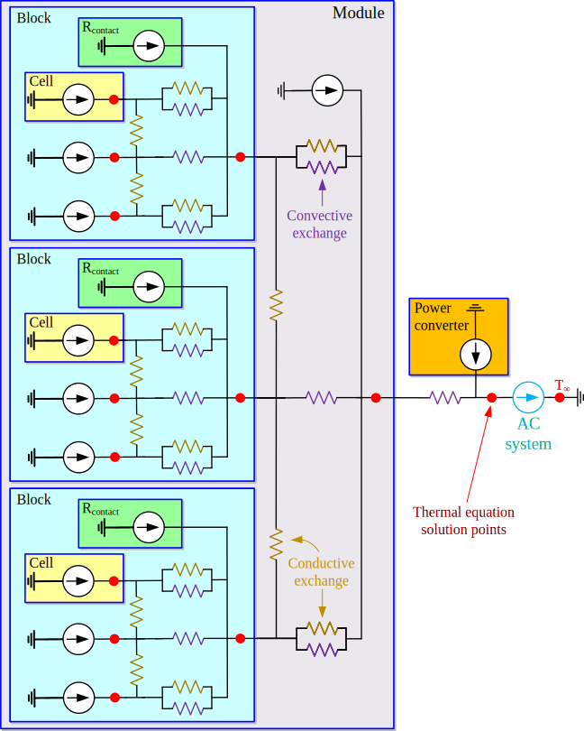
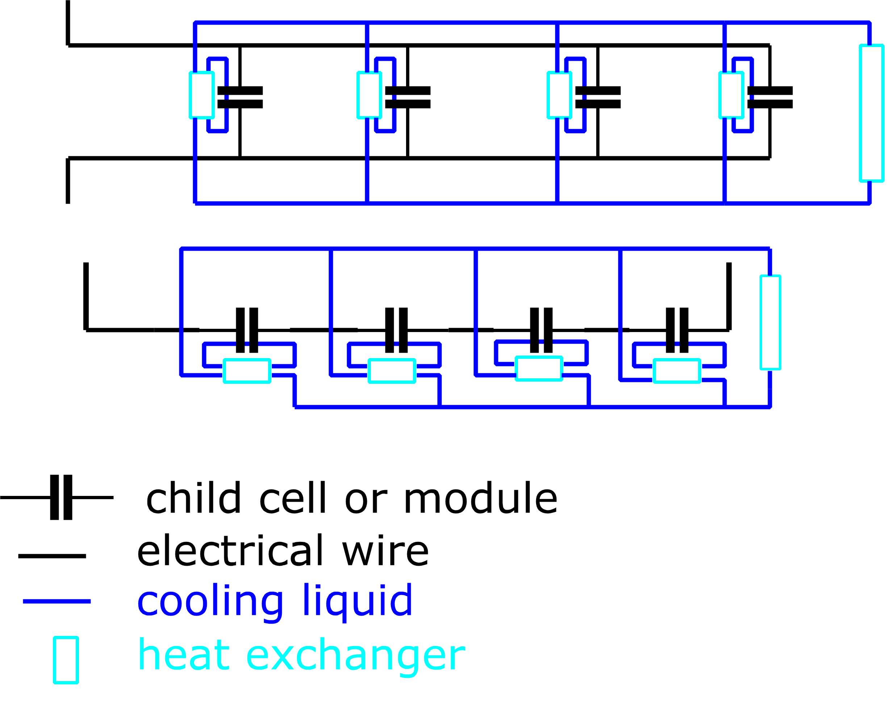

# Thermal Model

## Overall idea

Every `SU` calculates its own thermal balance (and its new temperature). It has a function where it gets as input the A, k or h, and T of every element with which it exchanges heat (cooling from the parent module, thermal coupling with neighbouring SUs), such that it can calculate it own energy balance.

Once every SU has calculated its energy balance, all the temperatures are updated at once (i.e. you don’t first update T of the first element and then calculate the thermal balance of the second element, since that would mess up the total energy balance as heat transfer is no longer symmetric).

So in short, the heat transfer is a simple lumped thermal model which could be represented as equivalent circuit models. Cells are heat sources, and exchange heat via kA or hA with neighbours or parents. The outer most module is cooled by the environment.

The total thermal system of an (outer) module, consisting of three (nested) modules, each having three cells is shown below. The thermal design is entirely hierarchical, just like the electrical design.

{:width="100%" }

The cooling from the module to the cells is convective with forced air (hA), the transfer between cells is conductive (kA). Note that cells in the middle of a stack get conductive heat transfer from 2 (hot) cells, one on either side. Cells at the ends of the stack (i.e. the first and last) get conductive heat from one (hot) cell, and on the other side from the cool edge of the module, which is assumed to be at the temperature of the coolant. So the thermal resistances between the module and edge-cells are (hA in parallel with kA) while the resistances between the module and the middle cells are only hA (and the ones between cells are kA). Note also that h >> k.

For ‘higher level’ modules, the surface area A increases. This ensures that those modules, which need to cool more cells, can exchange more heat to keep themselves cool. Their thermal inertia increases correspondingly to keep the model stable.

### How the thermal model is computed?

The state-space model of the thermal model is implemented in every class of StorageUnit. However, it is NOT called by the time-integration function of every SU. There are a bunch of reasons, e.g. cells do not know who their neighbours are, so they cannot get the parameters needed to compute the thermal model. Also we must ensure consistency (updating one SU’s temperature before calculating the thermal balance of another SU corrupts the system since the heat exchange between both cells will have changed between calculating the thermal balance for the 1st and 2nd cell so heat exchange is no longer symmetric).

Instead, the model is called ‘top down’. The top-level module calls its own thermal model (because it knows it does not have neighbours), and this will in turn call the thermal model of its child-modules, and so on all the way to the bottom level with the cells. After calculating the heat balance of its child SUs, the module will update the temperatures of its children (now we are sure about consistency). But it does not update its own temperature (which is done by its parent module).

The time-integration function of every SU has a test to check if this SU has a parent. If it has a parent, it does not call the thermal function (because the parent will do this for it). If the parent is the NULL-pointer, this SU knows it is the top-level, and the thermal model is called.

### In Cell_SPM

The thermal ODE is separated from the diffusion PDE. The latter (diffusion) is resolved at every dt-time step. Once per nstep*dt (where nstep = nOnce from Cyler), we accumulate the heat generated over the past nstep*dt seconds in Therm_Qgen.

The thermal ODE is in a separate function, thermalModel (defined in StorageUnit). The function has as inputs arrays with the temperature and heat transfer coefficient (h or k) for each neighbour. The total energy balance is then the sum of the the internal heat generation (`Therm_Qgen`), and the heat exchanged with all neighbours ( $$K[i]*A*(T[i] – get()$$). This energy is than translated to a change in temperature over the time since the last update of the temperature.

Note that the ‘A’ in the equation is the smaller of the A of this cell, and the A of the element with which this cell is exchanging heat. This is not really needed of all cells have the same A (and modules will have a bigger A), in that case you could just use the ‘A’ of this cell. However, it is needed when there are elements with surface areas smaller than the A of the cell (e.g. the neighbouring cells has a different geometry). In that case, A must be the overlapping surface area, which is the smaller of the surface areas of both cells.

If a cell has no parent, we are doing a ‘stand alone’ simulation where the cell is cooled by convective cooling with the environment (with a constant cooling constant and environmental temperature) as if the cell were in a thermal chamber. The thermal model is called in the timestep function (`timestep_CC`). If a cell has a parent, it is up to this parent to call the thermal model with the correct parameters for heat exchange with the cell’s neighbours and cooling from the module.

## Modules

Modules cool their child SUs (and let the child SUs compute their thermal model with the appropriate neighbours), and as a result heat up themselves.

In Module.cpp, the function thermalModle_coupled will figure out who the neighbours are of every child SUs. It then passes on this information as well as the info about their own temperature and convective cooling constant to the child SUs, such that every child SU can compute its own thermal balance. Note that all cells get the same module temperature, so the cooling circuit is ‘in parallel’ as indicated on the schematic below. The light blue ‘heat exchangers’ are the ‘thermal resistances’ from the equivalent circuit and simply represent air blowing over cells or air being sucked into the module. So you can imagine this as a big fan blowing air perpendicular to the stack of cells.
Note that heat transfer is perfect, and is simply calculated as $$hA(Tcool – Tchild)$$.

{:width="60%" }

Then the module computes its own heat exchanges (from cooling cells and with the information it got from its parent module about neighbouring modules and cooling from the parent module). This is still done in the same function in Module.cpp. However, the thermal balance (i.e. new temperature) is not computed here.

Every Module has an instance of CoolSystem which will do two things. Firstly, after the module has calculated its heat exchanges, the thermal balance (i.e. the thermal ODE) is computed in the cool system. Secondly, coolsystems can control the convective constant for the heat exchange with the child SUs. In other words, cool systems can increase the flow of coolant (i.e. the speed of the fan), increasing h and increasing the cooling to the child SUs. This allows to compare different control systems for the cooling system of the battery.

### Higher level modules

Modules can have different number of child-SUs, which in turn can be modules or cells. Ultimately, the cooling system of a module must process all the heat from each of the cells underneath it (either directly with the child-cells or indirectly through the child-modules which itself will cool their children). If all modules would have static parameters for h and A, the higher-level modules with more cells would overheat.

To avoid this, either A or h must be increased proportional to the number of cells the module needs to cool. At the moment, the former option is chosen. This implies that the speed of the coolant is constant throughout the battery, but larger modules have a larger fan with a bigger cross section, thus exchanging more heat. 

To prevent that the coolant overheat from this increased heat exchange, the thermal inertia of the (coolsystem of the module) is increased. Therefore, a linear increase in heat exchange (e.g. by cooling twice as many cells) will result in the same temperature change (e.g. by doubling the thermal inertia).

### Middle level modules

Middle level modules have an option of being an _open_ coolsystem, which basically means that there is no cooling at this level. Instead, the children of this module are cooled by the parents of this module. For instance, in a large battery container, modules might directly suck in air from the container without barrier at the ‘rack’ level.

In the equivalent circuit, this is achieved by using a high value of h (similar to a short circuit) but for numerical stability you can’t give too a high value. Additionally, the flow rate is 0 such that no power is required to get this high value of h.
This will ensure that the module is very close in temperature to its children. The _cooling power_ of the module is now the energy passing through it.

### Top level module

The top level module (representing the ‘container’) is a bit special because it does not have a parent module which can cool it. Therefore, this module must have an HVAC coolsystem (which is a child class of coolsystem). Such an hvac coolsystem has all the functionality from conventional coolsystem to cool its child SUs (e.g. by controlling the fan to blow air over racks).

However, it also takes care of cooling itself. The assumption is that it has an air conditioning unit which actively cools the module. The AC system isn’t explicitly simulated, there is just a variable giving the ‘cooling power’ from this AC. Because this is an active system, this cooling power is not dependent on the system or environmental temperature. It is assumed you can control it to simply ask a certain amount of cooling.

The cooling power is controlled similarly to the convective cooling constant to child SUs. Depending on the settings of the cooling system, the control system will determine how much cooling it wants to get from the AC unit and add this cooling power to the thermal balance of the module.

## Thermal coupling between neighbouring SUs

Cells next to each other (in one module), or modules next to each other (in a parent module) exchange heat as well, according to the conventional $$kA(T – T_{\rm neighbour})$$. Note that the first and last cell in a module have only one cell as neighbour. On their _other side_ is the module edge, which is supposed to be at the same temperature as the coolant

