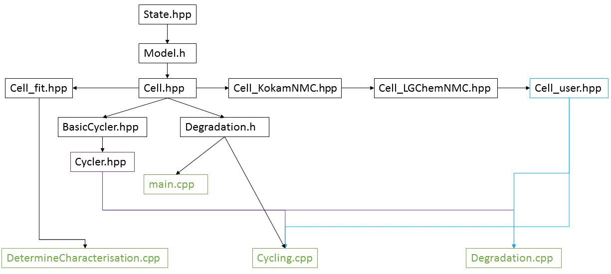

# Adding new cell type

There are in total 4 types of cells

- `Cell_fit`: this cell is used when fitting the characterisation parameters (see [Characterisation parametrisation](../3_using/5_character_parametrisation.html))
- `Cell_KokamNMC`: this cell has parameters for a high-power Kokam NMC cell and is used for cycling and degradation simulations
- `Cell_LGChem`: this cell has parameters for a high-energy LG Chem NMC cell and is used for cycling and degradation simulations
- `Cell_user`: this cell is made for the user to set his/her own parameters for his/her own type of cell (in the released code, the parameters are the same as the ones for the Kokam cell.

Users can make their own sub-class of Cell to implement another cell type. This class has to inherit Cell so that it can be used by the rest of the code. Additionally, the header-file structure must be corrected: the new cell type must include `Cell_user.hpp` in its header file, and in `cycling.cpp` and `degradation.cpp` the header type of the new Cell-subclass must be include instead of `Cell_user` (to avoid double- including header files).

The diagram below shows how the header-files are currently structured (the colours are for clarity only). The new Cell-subclass must be inserted to the right of `Cell_user` (which it has to include), and the lines to `cycling.cpp` and `degradation.cpp` have to come from the header file of this new subclass instead of from `cell_user.hpp`.

{:width="80%" }
