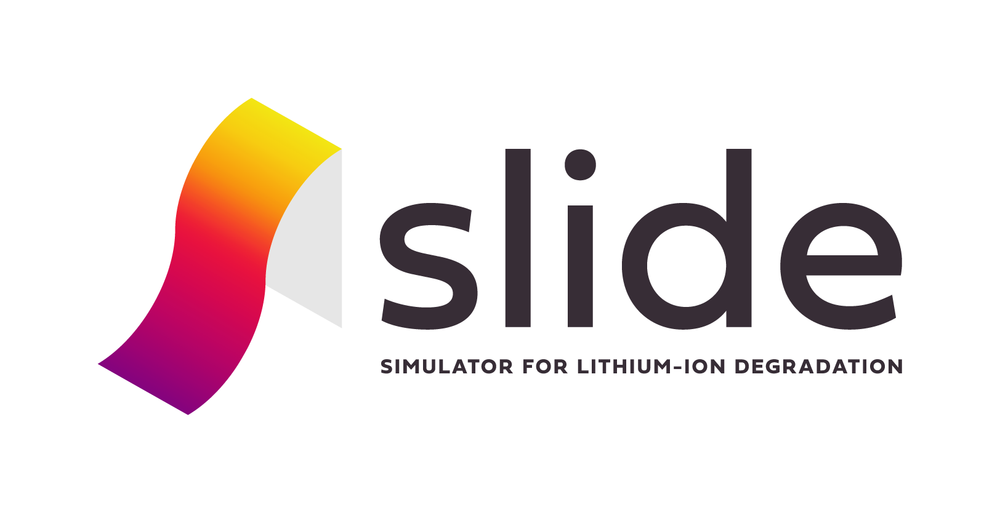

{:width="80%" }


About _Slide_
===========================

To cite this code, check the lastesta release DOI at https://zenodo.org/badge/latestdoi/185216614.

_Slide_ (simulator for lithium-ion degradation) is a code project mainly written in C++ to do fast simulations of degradation of lithium-ion batteries.
Simulating 5000 1C CC cycles should take less than 1 minute; adding a CV phase doubles the calculation time to below 2 minutes. The project uses object oriented programming in C++, see documentation for more details. 

The underlying battery model is the Single Particle Model (SPM) with a coupled bulk thermal model. 
A spectral implementation of the SPM in MATLAB was developed by Bizeray and Howey and is [available separately on GitHub](https://github.com/davidhowey/Spectral_li-ion_SPM). _Slide_ adds various degradation models on top of the SPM. The equations were taken from literature and implemented in one large coupled model. Users can easily select which models they want to include in their simulations. They can set the values of the fitting parameters of those degradation models to fit their own data.

_Slide_ is written to behave similarly to a battery tester. It offers functions to load cells with a constant current, a current profile or a constant voltage such that users can program their own degradation procedures. Some standard procedures have already been implemented (for calendar ageing and cycle ageing with regular CCCV cycles or with drive cycles). Also some reference performance tests have already been coded (to simulate a the capacity measurement, OCV curves, pulse discharge, etc.). Users can choose to store data points (current, voltage, temperature) at fixed time intervals during the degradation experiments, similar to how a battery tester stores such data.

The results from the simulations are written to csv files. Users can write their own code to read and plot these results, but MATLAB-scripts are provided for this too.

Detailed documentation is provided in the pdf documents. The code itself is also extensively documented.

If you use _Slide_ in your work, please cite our paper:

J.M. Reniers, G. Mulder, D.A. Howey, "Review and performance comparison of mechanical-chemical degradation models for lithium-ion batteries", Journal of The Electrochemical Society, 166(14), A3189, 2019, DOI [10.1149/2.0281914jes](https://doi.org/10.1149/2.0281914jes).

This code has been developed at the Department of Engineering Science of 
the University of Oxford. 
For information about our lithium-ion battery research, visit the [Battery Intelligence Lab](https://howey.eng.ox.ac.uk) website. 

For more information and comments, please contact 
[david.howey@eng.ox.ac.uk](david.howey@eng.ox.ac.uk).


Requirements
============
You will need a C++ programming environment to edit, compile and run the code.
Eclipse is the environment used to develop the code, but other environments should work as well.
Your computer must also have a C++ compiler installed.
The code has been tested using g++.
Extensive guidelines on how to install those programs is provided in the documentation.

To display the results, various MATLAB scripts are provided.
To run those, you will need to have installed MATLAB. 
The code has been tested using MATLAB R2018a, but should work with other releases with no or minor modifications.

To calculate the spatial discretisation, two open-source MATLAB functions developped by others are being used.
If you don't change the discretisation, you will not need them.
If you do change the discretisation, please read the license files attached to those two functions ('license chebdif.txt' and 'lisence cumsummat.txt').

 
Installation
============
### Option 1 - Downloading a .zip file ###
[Download a .zip file of the code](https://github.com/davidhowey/SLIDE/archive/master.zip)

Then, unzip the folder in a chosen directory on your computer.

### Option 2 - Cloning the repository with Git ###
To clone the repository, you will first need to have [Git][6] installed on 
your computer. Then, navigate to the directory where you want to clone the 
repository in a terminal, and type:
```bash
git clone https://github.com/davidhowey/SLIDE.git
```
The folder containing all the files should appear in your chosen directory.


Getting started
===============
Detailed instructions on how to get started are in the documentation.
You first have to import the code to your programming environment and make sure the settings are correct (e.g. to allow enough memory for the calculation).
Then you can open main.cpp, which implements the main-function. In this function you choose what to simulate by uncommenting the thing you want to do (and commenting all other lines). 
It is recommended to start with the CCCV-function, which simulates a few CCCV cycles.
You will then have to build (or compile) the code, which might take a while the first time you do this.
Now you can run the code (either locally in the programming environment or by running the executable which was created by the compiler).
While the simulation is running, csv files with the results are written in one or multiple subfolders.
When the simulation has finished, you can run the corresponding MATLAB-script (e.g. readCCCV.m) to plot the outcomes.

Much more detailed documentation can be found in the documentation (from '1 Getting started' to '7 appendixes; debugging, basics of C++, object oriented programming'). These guides are mostly independent of each other, so you don't have to read all of them.
Also the code itself is extensively commented, so you might not have to read the guides at all.


License
=======
This open-source C++ and MATLAB code is published under the BSD 3-clause License,
please read `LICENSE.txt` file for more information.

Two MATLAB functions used by the code to produce the spatial discretisation have been developed by others.
They come with their own licence, see 'license chebdif.txt' and 'licence cumsummat.txt'.
